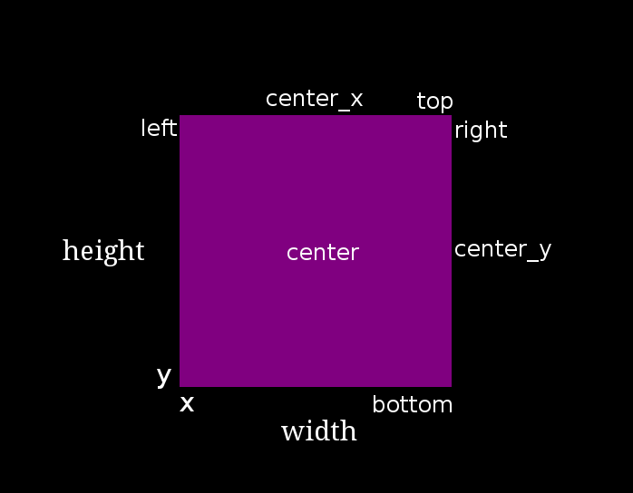

=================
Advanced SMILEing
=================

Screen Placement of Visual States
=================================

In SMILE, any state that displays something to the screen is known as
a :py:class:`~smile.video.VisualState`. These states share the ability to set
their size, position, and relative position to each other. Every visual state
has the following basic attributes, and all of the following attributes can be
passed into the initialization of the visual states in your code:

- width

- height

- x

- y

Now, imagine a scenario where one would want to place a :py:class:`~smile.video.Label`
400 pixels above a :py:class:`~smile.video.TextInput`, which is 200 pixels to the left
of the bottom right hand corner of the screen. Hard calculations of those numbers by hand or
relativistic positioning attributes could be employed to yield the answer.

By utilizing the relative position attributes, the **VisualStates** can be initialized
to the left or right, above or below, of each other. An example of this is as follows:

.. code-block:: python
    :linenos:

    from smile.common import *

    exp = Experiment()

    with Parallel():
        lb1 = Label(text="I AM NEAR THE BOTTOM", right=exp.screen.right - 200,
                    bottom=exp.screen.bottom, duration=5)
        lb2 = Label(text="I AM ABOVE THE OTHER LABEL", right=lb1.right,
                    bottom=lb1.top + 400, duration=5)

    exp.run()

In the above example, the *right* attribute of the visual
states is used as both initialization parameters and attributes. This can be accessed from
one state and applied to the next. We also used the attribute *bottom* which works
the exact same way. The following are a list of all the attributes that are in terms of
x, y, width, and height:

- bottom : y

- top : y + height

- left : x

- right : x + width

- center_x : (x + width) / 2

- center_y : (y + height) / 2

Multiple of these can be combined together to access a tuple value that contains
both pieces of information. These combined attributes are listed
below in terms of x, y, width, and height:

- center : ((x + width) / 2, (y + height) / 2)

- center_top : ((x + width) / 2, y + height)

- center_bottom : ((x + width) / 2, y)

- left_center : (x, (y + height) / 2)

- left_bottom : (x, y)

- left_top : (x, y + height)

- right_center : (x + width, (y + height) / 2)

- right_bottom : (x + width, y)

- right_top : (x + width, y + height)

.. _setting_in_rt:

SMILE References
================

A SMILE *Ref* is a delayed function call. Its paramters are a function and any
arguments for that function. A *Ref* will not run the function with those
parameters, however, until the value of the reference is needed during Run Time.

Not only can a *Ref* delay the evaluation of a function call, it can also delay
the evaluation of conditional statements, getting an item from a list, or even
simple mathamatical statements.

Getitem with References
+++++++++++++++++++++++

*Ref.getitem()* is only important when the item that you are trying to get from
a list like object has an index that is a Ref. This ref could come from a
calculation that you are trying to do during runtime, the index of the current
iteration of a loop, or even the result of another call to *Ref.getitem()*.

Below is an example of how to use *Ref.getitem()*

Setting a variable in RT
++++++++++++++++++++++++

Like it is stated in :ref:`Build Time VS Run Time <run_build_time>`, in order to
set a variable in SMILE during **RT**, the *exp.variable_name* syntax must be
used. In this section, the results of calling 'exp.variable_name' in SMILE will
be examined.

The following is a sample experiment where *exp.display_me* is set to a string:

.. code-block:: python

    from smile.common import *

    exp = Experiment()

    exp.display_me = "LETS DISPLAY THIS SECRET MESSAGE"
    Label(text=exp.display_me)

    exp.run()

This is a very simple experiment. It must be understood that
*exp.display_me = "LETS DISPLAY THIS SECRET MESSAGE"* creates a
:py:class:`~smile.experiment.Set` state. A **Set** state takes a string
*var_name* that refers to a variable in an **Experiment** or to a newly created
variable, and a *value* that refers to the value that the variable is assigned
to take on. The important takeaway is that 'value' can be referenced to a value.
If 'value' is a reference, it will be evaluated during **RT**.  Below is an
example of what the experiment would look like if the 3rd line is changed:

.. code-block:: python

    from smile.common import *

    exp = Experiment()

    Set(var_name="display_me", value="LETS DISPLAY THIS SECRET MESSAGE")
    Label(text=exp.display_me)

    exp.run()

Both sample experiments run the exact same way, but the only difference is how
the code looks to the end user. The Set state is untimed, so it changes the
value of the variable immediately at enter. For more information look at the
docstring for :py:class:`~smile.experiment.Set` and the code behind the
**smile.experiment.Experiment.set_var()** method.

.. _func_ref_def:

Performing Operations and Functions in RT
+++++++++++++++++++++++++++++++++++++++++

Until this point, new methods that run during **RT** have not run correctly. In
this section, examining why this happens and correcting this issue will be
discussed.

Since every SMILE experiment is separated into **BT** and **RT**, any calls to
functions or methods without using the proper SMILE syntax will run in **BT**
and not **RT**. In order to run a function or method, a
:py:class:`~smile.ref.Ref` or a :py:class:`~smile.state.Func` is needed to be
used. As stated in :ref:`The Reference Section <ref_def>` of the state machine
document, a **Ref** is a delayed function call.

**When it is desired to pass in the return value of a function to a SMILE state
as a parameter, it is appropriate use** **Ref**. The first parameter for a
**Ref** call is always the function desired to run, and the other parameter to
that function call are the rest of the parameters to the **Ref**.

Below is an example of a loop that displays the counter of the loop in a label
on the center of the screen. Since the :py:class:`~smile.state.Loop` counter is
an integer, the integer must first be changed to a string. This can be performed
by creating a **Ref** to call 'str()'.

.. code-block:: python

    with Loop(100) as lp:
        #This Ref is a delayed function call to str where
        #one of the parameters is a reference. Ref also
        #takes care of evaluating references.
        Label(text=Ref(str, lp.i), duration=0.2)

**To run a function during RT** the **Func** state is needed.
**Func** creates a state that will not run the passed in function call
until the previous state leaves. The following is an example of using a **Func**
to generate the next set of stimulus for each iteration of a **Loop**. To access
the return value of a method or function call, the *.result* attribute of
the **Func** state must be accessed.

.. code-block:: python

    #Assume DisplayStim is a predefined Subroutine
    #that displays a list of stimulus, and assume that
    #gen_stim is a predefined function that generates
    #that stimulus
    with Loop(10) as lp:
        stim = Func(gen_stim, length=lp.i)
        DisplayStim(stim.result, duration=5)

.. note::

    Remember that you can pass in keyword arguments AND regular arguments into both Func states and Ref calls.

Extending Smile
===============

There may be cases where SMILE lacks functionality needed to run an experiment
properly. Several different methods can be employed to **extend** SMILE's functionality.
The first method is **Subroutine**, which is a section of state machine code that can
be run at several different points in an experiment, similar to a function. The
second is referred to as **Wrapping Widgets**. Any widgets written and defined in
**Kivy** can be wrapped into a SMILE :py:class:`~smile.video.WidgetState`.

Defining Subroutines
--------------------

In SMILE, there exists special states called :py:class:`Subroutines <~smile.state.Subroutine>`.
**Subroutines** are special states that contain small chunks of state machine code
that the main experiment will need to run over and over again. Like a function,
a **Subroutine** is defined with the python *def* followed by the name of the
Subroutine. In SMILE, it is proper practice to name any state with the first
letter of every word a capital letter.

.. note::

    Please note that Subroutines should only be used as self contained snipits of state-machine. Only write a subroutine if the section of state-machine you are trying to replicate would rely only on the parameters passed into it. You should never try to change the value of a parameter inside the Subroutine from outside the Subroutine. However, you have read-only access to any variable set using the **self** reference explained below. If you would like to have access to the height of a Label inside your subroutine outside your subroutine, you must set **self** variable to the Height of your Label during Experimental Build Time.

The following is an example on how to define a **Subroutine** that displays a :py:class:`~smile.video.Label`
that will display a number that counts up from a passed in minimum number.

In the subroutine file (*test_sub.py*), first import all of SMILE's common states:

.. code-block:: python

    from smile.common import *

.. warning::

    Be advised, the above line does not always give every necessary state for an experiment, just the States that are available on every platform.

Next, the definition line needs to be written for the subroutine:

.. code-block:: python

    @Subroutine
    def CountUpFrom(self, minVal):

First, notice the *@Subroutine*. This allows *CountUpFrom* to be a subclass of
*Subroutine*, the general subroutine state.

.. note::

    Please note the *self* as the first argument passed into a subroutine. If self is not passed, SMILE will throw an error. Please remember to pass in *self* as the first parameter when defining a subroutine.

Now we can write state machine code for the **Subroutine**:

.. code-block:: python

    from smile.common import *
    @Subroutine
    def CountUpFrom(self, minVal):

        # Initialize counter, Creates a Set state
        # and sets the variable at Experimental Runtime.
        # After this line, self.counter is a reference object
        # that can be reference anywhere else in this subroutine.
        self.counter = minVal
        # Define the Loop, loop 100 times
        with Loop(100):
            # Apply the plus-equals operator to
            # self.counter to add 5
            self.counter += 5
            # Display the reference self.counter in
            # string form. Ref(str, self.counter) is required
            # to apply the str() function to self.counter during
            # Experimental Runtime instead of Buildtime
            Label(text=Ref(str,self.counter), duration=.2)
.. warning::

    When writting a Subroutine, you can only use SMILE States. A Subroutine will only run any general pythonic code ONCE when the Subroutine is first built during Experimental Build Time. It is best practice to only use SMILE states, sets, and gets during in a Subroutine. If you need to run some kind of complex function in order to run your subroutine, use the **Func** state to run a function during Experimental Run Time.

Notice *self.counter*, it creates a :py:class:`~smile.state.Set`
state that will set a new attribute to the **Subroutine** called *counter* and
will initialize it to *minVal* during
:ref:`Experimental Runtime <run_build_time>`_.

Anything initialized with the *self.* will be able to be accessed from outside
of the **Subroutine**.  If the above Subroutine is used as an example, the
**Subroutine** as *cup = CountUpFrom()* can be initialized and *cup.counter*
can be called to get at the value of the counter.

The following is an example of calling this subroutine during an actual
experiment:

.. code-block:: python

    from smile.common import *

    from countup import CountUpFrom

    exp = Experiment()

    # Just like writing any other state declaration
    cuf = CountUpFrom(10)
    # Print out the value of the counter in CountUpFrom
    # To the command line
    Debug(name="Count Up Stuff", end_counter=cuf.counter)

    exp.run()

Wrapping Kivy Widgets
---------------------

Currently, most of the visual states in SMILE are *wrapped* Kivy widgets.
:py:class:`~smile.video.Rectangle`, :py:class:`~smile.video.Image`, and
:py:class:`~smile.video.Video` are all examples of Kivy widgets that were
wrapped in the *video.py* code and turned into
:py:class:`WidgetStates <~smile.video.WidgetState>`.

if there is a desired function that SMILE can't performed using pre-written
states, and the function cannot be created by writing a
:py:class:`~smile.state.Subroutine`, Kivy widgets can be written to achieve this
functionality. To write a Kivy widget for SMILE, the knowledge of the SMILE
backend and Kivy is needed. This section is only for those who want to write
their own widgets!

The `My First Widget<https://kivy.org/docs/tutorials/firstwidget.html>` gives a
thorough examination on how to create a very basic Kivy widget and display it on
a Kivy app. This also provides sufficient start on how to create a Kivy widget.

For following example, dotbox.py will be examined. A program was written to
produce tiny dots on the screen in an area. The most efficient way
accomplish this is through the creation of a Kivy widget.

Here is the definition of our *DotBox*:

.. code-block:: python

    @WidgetState.wrap
    class DotBox(Widget):
        """Display a box filled with random square dots.

        Parameters
        ----------
        num_dots : integer
            Number of dots to draw
        pointsize : integer
            Radius of dot (see *Point*)
        color : tuple or string
            Color of dots
        backcolor : tuple or string
            Color of background rectangle

        """

        # Define the widget Parameters for Kivy
        color = ListProperty([1, 1, 1, 1])
        backcolor = ListProperty([0, 0, 0, 0])
        num_dots = NumericProperty(10)
        pointsize = NumericProperty(5)

In *DotBox* several different parameters are needed to be passed into the
*__init__* method in order to create different kinds of DotBoxes.

    - Color : A list of float values that represent the RGBA of the dots

    - backcolor : A list of float values that represent the RGBA of the background

    - num_dots : The number of random dots to generate

    - pointsize : How big to draw the dots, pointsize by pointsize squares in pixels

Next, the '__init__' method is declared for our 'DotBox' widget:

.. code-block:: python

    def __init__(self, **kwargs):
        super(type(self), self).__init__(**kwargs)

        # Initialize variables for Kivy
        self._color = None

        self._backcolor = None

        self._points = None

        # Bind the variables to the widget
        self.bind(color=self._update_color,
                  backcolor=self._update_backcolor,
                  pos=self._update,
                  size=self._update,
                  num_dots=self._update_locs)

        # Call update_locs() to initialize the
        # point locations
        self._update_locs()

The *.bind()* method will bind each different attribute of the dot box to a
method callback that might want to run if any of those attributes change.
An example of this is if, in SMILE, an :py:class:`~smile.video.UpdateWidget`
state is created where it updates a **DotBox** attribute, e.g. *num_dots* attribute.
The attribute change will cause Kivy to callback the corresponding function
attached with *.bind()*. Now the functions can be defined:

.. code-block:: python

    # Update self._color.rgba
    def _update_color(self, *pargs):
        self._color.rgba = self.color

    # Update self._backcolor.rgba
    def _update_backcolor(self, *pargs):
        self._backcolor.rgba = self.backcolor

    # Update the locations of the dots, then
    # Call self._update() to redraw
    def _update_locs(self, *pargs):
        self._locs = [random.random()
                      for i in xrange(int(self.num_dots)*2)]
        self._update()

    # Update the size of all of the dots
    def _update_pointsize(self, *pargs):
        self._points.pointsize = self.pointsize

    # Draw the points onto the Kivy Canvas
    def _update(self, *pargs):
        # calc new point locations
        bases = (self.x+self.pointsize, self.y+self.pointsize)
        scales = (self.width-(self.pointsize*2),
                  self.height-(self.pointsize*2))
        points = [bases[i % 2]+scales[i % 2]*loc
                  for i, loc in enumerate(self._locs)]

        # draw them
        self.canvas.clear()
        with self.canvas:
            # set the back color
            self._backcolor = Color(*self.backcolor)
            # draw the background
            Rectangle(size=self.size,
                      pos=self.pos)
            # set the color
            self._color = Color(*self.color)
            # draw the points
            self._points = Point(points=points, pointsize=self.pointsize)

Any visual widget created in Kivy will require some kind of drawing to the
canvas. In the above example, the line *with self.canvas* was used to define the
area in which calls to the graphics portion of Kivy were made, *kivy.graphics*.
The color of what to be drawn was set, then it was drawn. For example, *Color()* sets
the draw color, then *Rectangle()* tells **kivy.graphics** to draw a rectangle
of that color to the screen.

Since this Widget defined in Kivy will be wrapped with a **WidgetState**, it
can be assumed that this widget will have access to arguments like *self.pos, self.size*,
and obviously arguments like *self.x, self.y, self.width, self.height*.

dotbox.py in Full
-----------------

.. code-block:: python

    @WidgetState.wrap
    class DotBox(Widget):
        """Display a box filled with random square dots.

        Parameters
        ----------
        num_dots : integer
            Number of dots to draw
        pointsize : integer
            Radius of dot (see *Point*)
        color : tuple or string
            Color of dots
        backcolor : tuple or string
            Color of background rectangle

        """
        color = ListProperty([1, 1, 1, 1])
        backcolor = ListProperty([0, 0, 0, 0])
        num_dots = NumericProperty(10)
        pointsize = NumericProperty(5)

        def __init__(self, **kwargs):
            super(type(self), self).__init__(**kwargs)

            self._color = None
            self._backcolor = None
            self._points = None

            self.bind(color=self._update_color,
                      backcolor=self._update_backcolor,
                      pos=self._update,
                      size=self._update,
                      num_dots=self._update_locs)
            self._update_locs()

        def _update_color(self, *pargs):
            self._color.rgba = self.color

        def _update_backcolor(self, *pargs):
            self._backcolor.rgba = self.backcolor

        def _update_locs(self, *pargs):
            self._locs = [random.random()
                          for i in xrange(int(self.num_dots)*2)]
            self._update()

        def _update_pointsize(self, *pargs):
            self._points.pointsize = self.pointsize

        def _update(self, *pargs):
            # calc new point locations
            bases = (self.x+self.pointsize, self.y+self.pointsize)
            scales = (self.width-(self.pointsize*2),
                      self.height-(self.pointsize*2))
            points = [bases[i % 2]+scales[i % 2]*loc
                      for i, loc in enumerate(self._locs)]

            # draw them
            self.canvas.clear()
            with self.canvas:
                # set the back color
                self._backcolor = Color(*self.backcolor)

                # draw the background
                Rectangle(size=self.size,
                          pos=self.pos)

                # set the color
                self._color = Color(*self.color)

                # draw the points
                self._points = Point(points=points, pointsize=self.pointsize)

Effective timing of KeyPress
============================

In order to increase the effectiveness of a **KeyPress** state, you can set a
*base_time* parameter. A **KeyPress** will calculate the reaction time, or *rt*,
by subtracting the *base_time* from the *press_time*. If no *base_time* is
passed in as a paramter to **KeyPress**, SMILE will set the *base_time* to the
**KeyPresses** *start_time*.

When you want someone to press a button **immediately** after they see a
stimulus, you need to set the *base_time* as the *appear_time['time']*. See an
example of this below.

.. code-block:: python

    press = Label(text="Press NOW!")
    with UntilDone():
        Wait(min_response_time)
        kp = KeyPress(base_time=press.appear_time['time'])

When you want a participant to press a button **immediately** after they see a
stimulus disappear off the screen, you need to set the *base_time* as the
*disappear_time['time']*. See an example of this below.

.. code-block:: python

    press = Label(ext="Press When I Disappear", duration=2.0)
    Wait(until=press.disappear_time)
    kp = KeyPress(base_time=press.disappear_time['time'])

Timing the Screen Refresh VS Timing Inputs
==========================================

Before examining this section, it is important to understand how SMILE displays
each frame of your experiment. SMILE runs on a two buffer system, where when
a frame is being prepared, it is drawn to a *back buffer*. When everything is
drawn and/or ready, the *back buffer* is flipped to the *front buffer*, then the
back buffer is cleared to get ready for more drawing.

The following is a detailed example: an experiment wants to display
a new :py:class:`~smile.video.Label` onto the screen. The first thing SMILE does
is draw the Label onto the back buffer, then calls for a **Blocking Flip**. A
**Blocking Flip** is when SMILE waits for everything to be finished writing to
the screen, then flips the next time it passes through the event loop if it is
around the flip interval. Then SMILE flips into **NonBlocking Flip** Mode. In
this mode, SMILE will try and flip the buffer as soon as anything changes.
SMILE switches to this mode to allow Kivy to update the screen whenever it needs
to. The other time in a Visual State's lifespan where SMILE calls for a
**Blocking Flip** is when it disappears from the screen. SMILE uses
**Blocking Flips** for the appearance and disappearance of a VisualState to
accurately track the timing of those two events.

In SMILE, the end user can force the 2 different modes of updating the screen
using :py:class:`~smile.video.BlockingFlip` and
:py:class:`~smile.video.NonBlockingFlip`. They both are important, for they both
grant the ability to prioritize different aspects of an experiment, *input* or
*output*, when it comes to timing things as accurately as possible.

A **NonBlockingFlip** is used when the timing of visual stimulus isn't the most
important. If SMILE is forced into this mode, timing of input can be made much
more accurate, like mouse and keyboard. SMILE can be forced into
NonBlockingFlips by putting this state in parallel with what is desired to run
in NonBlockingFlip Mode.

The following is a mini example of such a **Parallel**:

.. code-block:: python

    with Parallel() as p:
        NonBlockingFlip()
        lb = Label(text="PRESS NOW!!!")
        with UntilDone():
            Wait(until=lb.appear_time)
            kp = KeyPress(base_time = lb.appear_time['time'])

A **BlockingFlip** is used when the timing of screen appearance takes priority
over when the timing of inputs occur. Using this mode, the changes in *exp._last_flip*
can be :py:class:`~smile.state.Record`.

An example of this is as follows:

.. code-block:: python

    with Parallel():
        BlockingFlip()
        vd = Video(source="test_vid.mp4")
        Record(name="video_record", flip=exp._last_flip)

Information for SMILE Developers
================================

Below will be several sections that better explain all of the intricacies of
SMILE's backend. Look at this section only if you are interested in creating
your own states, or better understanding how SMILE does what it does.

The States of a State
---------------------

Every state in SMILE runs through 6 main function calls. These function calls
are automatic and never need to be called by the end user, but it is important
to understand what they do and when they do it to fully understand SMILE.
These function calls are *__init__*, *.enter()*, *.start()*, *.end()*,
*.leave()*, and *.finalize()*. Each of these calls happen at different parts of
the experiment, and have different functions depending on the subclass.

**.__init__** happens during **BT** and is the only one to happen at **BT**.
This function usually sets up all of the references, processes some of the
parameters, and knows what to do if a parameter is missing or wasn't passed in.

**.enter()** happens during **RT** and will be called after the previous state
calls *.leave()*. This function will evaluate all of the parameters that were
references, and set all the values of the remaining parameters. It will also
schedule a start time for this state.

**.start()** is a class of function calls that, during **RT**, the state starts
doing whatever makes it special. This function is not always called *.start()*.
In the case of an :py:class:`~smile.video.Image` state, *.start()* is replaced
with *.appear()*. The *.start()* functions could do anything from showing an
image to recording a keypress. After *.start()* this state will begin actually
performing its main function.

.. note::

    A *.start()* kind of call will only exist in an Action State (see below).

**.end()** is a class of function calls that, during **RT**, ends whatever makes
the state special. In the case of an Image, *.end()* is replaced with
*.disappear()*. After *.end()*, *.leave()* is available to be called.

.. note::

    A *.end()* kind of call will only exist in an Action State (see below).

**.leave()** happens during **RT** and will be called whenever the duration of
a state is over, or whenever the rules of a state says it should end. A special
case for this is the *.cancel()* call. If a state should need to be ended early
for whatever reason, the *Experiment* will call the state's *.cancel()* method
and that method will setup an immediate call to both *.leave()* and
*.finalize()*.

**.finalize()** happens during **RT** but not until after a state has left.
This call usually happens whenever the clock has extra time, i.e. during a :py:class:`~smile.state.Wait`
state. This call will save out the logs, setup callbacks to the :py:class:`~smile.state.ParentState` to
tell it that this state has finished, and set *self.active* to false. This call
is used to clean up the state sometime after the state has run *.leave()*.

The SMILE timing Algorithm
--------------------------

Write up coming soon.

Want to Contribute to SMILE?
============================

SMILE has a GitHub page that, if you find an issue and fix it or want to add
functionality to SMILE, you may make a pullrequest to. At `GitWash <https://github.com/compmem/smile/tree/master/docs/devel/gitwash>`_
you can find documents to better understand how to make use Git and how to make
changes and update SMILE.
