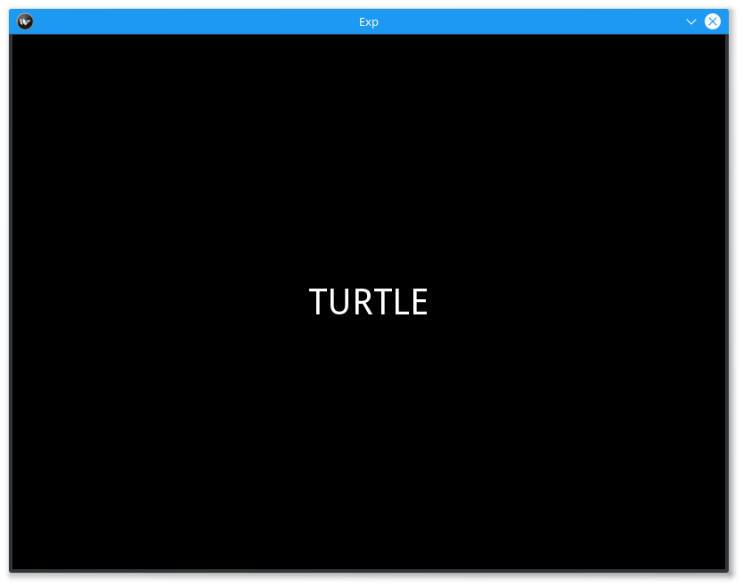

===========
Free Recall
===========

Free-Recall is a psychological paradigm where the participant is shown a list of
words and is then asked to recall the displayed words in any order immediately
after being shown or after a period of delay.

The kind of Free-Recall Experiment that we wrote is the Immediate Free-Recall
task. Our participant will view 10, 15, or 20 words and then be asked to recall
as many words as possible from the list in 20, 30, or 40 seconds respectively.
This experiment will show you how to use the :py:class:`~smile.state.Subroutine`
called :py:class:`~smile.freekey.FreeKey`, as well as things like :py:class:`~smile.video.Label`
and :py:class:`~smile.state.Loop`.

Below we will show you the best practices for coding an experiment like this one.

The Experiment
==============

The best thing to do when coding a SMILE experiment is to break up the
experiment into 3 different files: the experiment file with all the SMILE code,
the config file with all the experimental variables, and the stimulus
generation file.

The first thing we will look at is `free_recall.py`. In this file we need to
import smile as well as execute the `config.py` and the `gen_stim.py`.

.. code-block:: python
    :linenos:

    #freekey.py
    from smile.common import *
    from smile.freekey import FreeKey

    #execute both the configuration file and the
    #stimulus generation file
    from config import *
    from gen_stim import *

Inside `config.py` we setup any variables that will need to be used during the
experiment as well as open any files that we might need for list generation or
instructions for the participant.

.. code-block:: python
    :linenos:

    from pathlib import Path

    # Get the directory where this script is located
    script_dir = Path(__file__).parent.absolute()

    # Define paths to the stimulus files, relative to the script's location
    POOLS_DIR = script_dir / "pools"
    LIVING_TXT_PATH = POOLS_DIR / "living.txt"
    NONLIVING_TXT_PATH = POOLS_DIR / "nonliving.txt"

    # Open and combine the stimulus files with error handling
    try:
        living_list = LIVING_TXT_PATH.read_text().splitlines()
        nonliving_list = NONLIVING_TXT_PATH.read_text().splitlines()
    except FileNotFoundError as e:
        print(f"Error: Stimulus file not found. {e}")
        exit(1)

    stim_list = living_list + nonliving_list

    # Open the instructions file, also relative to the script's location
    INSTRUCTIONS_PATH = script_dir / 'freekey_instructions.rst'
    try:
        instruct_text = INSTRUCTIONS_PATH.read_text()
    except FileNotFoundError as e:
        print(f"Error: Instructions file not found. {e}")
        exit(1)

    # Define the Experimental Variables (Constants)
    INTER_STIMULUS_INTERVAL = 2
    INTER_BLOCK_INTERVAL = 2
    STIMULUS_DURATION = 2
    PRE_FREE_KEY_INTERVAL = 4
    FONT_SIZE = 40
    RST_FONT_SIZE = 30
    RST_WIDTH = 900
    MIN_FREE_KEY_DURATION = 20

    NUM_BLOCKS = 6
    NUM_PER_BLOCK = [10, 15, 20]

Next we can take a look into our list gen. Simply, we generate a list of
dictionaries where **study** points to a list of words and **duration** points
to the duration that the participants have to freely recall the words.

.. code-block:: python
    :linenos:

    import random
    from config import NUM_BLOCKS, stim_list, NUM_PER_BLOCK, MIN_FREE_KEY_DURATION

    # Shuffle the stimulus list for randomness
    random.shuffle(stim_list)

    blocks = []
    for block_index in range(NUM_BLOCKS):
        study_items = []

        # Select stimuli for the current block based on NUM_PER_BLOCK
        num_items_in_block = NUM_PER_BLOCK[block_index % len(NUM_PER_BLOCK)]
        for _ in range(num_items_in_block):
            study_items.append(stim_list.pop())

        # Create a block dictionary with study items and duration
        block_duration = MIN_FREE_KEY_DURATION + \
            10 * (block_index % len(NUM_PER_BLOCK))
        blocks.append({
            "study": study_items,
            "duration": block_duration
        })

    # Shuffle the blocks to ensure random order of blocks
    random.shuffle(blocks)

Finally we can get to the fun stuff! We now can start programming our SMILE
experiment. The comments in the following section of code explain why we do each
part of the experiment.

.. code-block:: python

    # Initialize the Experiment
    exp = Experiment(debug=True)

    # Show the instructions to the participant
    RstDocument(text=instruct_text, base_font_size=RST_FONT_SIZE,
                width=RST_WIDTH, height=exp.screen.height)
    with UntilDone():
        # When a KeyPress is detected, the UntilDone
        # will cancel the RstDocument state
        KeyPress()
    # Start the experiment Loop
    with Loop(blocks) as block:
        Wait(INTER_BLOCK_INTERVAL)
        with Loop(block.current['study']) as study:
            # Present the Fixation Cross
            Label(text="+", duration=INTER_STIMULUS_INTERVAL, font_size=FONT_SIZE)

            # Present the study item and add debug information for current stimulus
            Debug(study.current)
            Label(text=study.current, duration=STIMULUS_DURATION, font_size=FONT_SIZE)

        Wait(PRE_FREE_KEY_INTERVAL)

        # Start FreeKey session
        fk = FreeKey(Label(text="XXXXXXX", font_size=FONT_SIZE),
                    max_duration=block.current['duration'])
        # Log everything!
        Log(block.current,
            name="FreeKey",
            responses=fk.responses)
    # Run the experiment
    exp.run()

Analysis
========

When coding your experiment, you don't have to worry about losing any data
because all of it is saved out into `.slog` files anyway. The thing you do have
to worry about is whether or not you want that data to be easily available or if you
want to spend hours **slogging** through your data. We made it easy for you
to pick which data you want saved out during the running of your experiment with
use of the **Log** state.

Relevant data from the **Free-Recall** task would be the responses from each
**FreeKey** state. In the **Log** that we used in the experiment above, we
log everything in each *block* of the experiment, i.e. the stimulus and the
duration that they are allowed to respond in, and the responses from **FreeKey**.

If you would like to grab your data from the `.slog` files to analyze your data
in python, you need to use the :py:func:`~smile.log.log2dl`. This function will
read in all of the `.slog` files with the same base name, and convert them into
one long list of dictionaries. Below is a the few lines of code you would use to
get at all of the data from three imaginary participants, named as `s000`, `s001`,
and `s002`.

.. code-block:: python
    :linenos:

    from smile.log as lg
    #define subject pool
    subjects = ["s000/","s001/","s002/"]
    dic_list = []
    for sbj in subjects:
        #get at all the different subjects
        dic_list.append(lg.log2dl(log_filename="data/" + sbj + "Log_FreeKey"))
    #print out all of the study times in the first study block for
    #participant one, block one
    print dic_list[0]['study_times']

You can also translate all of the `.slog` files into `.csv` files easily by
running the command :py:func:`~smile.log.log2csv` for each participant. An example of this is
located below.

.. code-block:: python
    :linenos:

    from smile.log as lg
    #define subject pool
    subjects = ["s000/","s001/","s002/"]
    for sbj in subjects:
        #Get at all the subjects data, naming the csv appropriately.
        lg.log2csv(log_filename="data/" + sbj + "Log_FreeKey", csv_filename=sbj + "_FreeKey")

free_recall.py in Full
======================

.. code-block:: python
    :linenos:

    from smile.common import *
    from smile.freekey import FreeKey

    # BROKEN - ValueError

    # execute both the configuration file and the
    # stimulus generation file
    from config import *
    from gen_stim import *

    # Initialize the Experiment
    exp = Experiment(debug=True)

    # Show the instructions to the participant
    RstDocument(text=instruct_text, base_font_size=RST_FONT_SIZE,
                width=RST_WIDTH, height=exp.screen.height)
    with UntilDone():
        # When a KeyPress is detected, the UntilDone
        # will cancel the RstDocument state
        KeyPress()
    # Start the experiment Loop
    with Loop(blocks) as block:
        Wait(INTER_BLOCK_INTERVAL)
        with Loop(block.current['study']) as study:
            # Present the Fixation Cross
            Label(text="+", duration=INTER_STIMULUS_INTERVAL, font_size=FONT_SIZE)

            # Present the study item and add debug information for current stimulus
            Debug(study.current)
            Label(text=study.current, duration=STIMULUS_DURATION, font_size=FONT_SIZE)

        Wait(PRE_FREE_KEY_INTERVAL)

        # Start FreeKey session
        fk = FreeKey(Label(text="XXXXXXX", font_size=FONT_SIZE),
                    max_duration=block.current['duration'])
        # Log everything!
        Log(block.current,
            name="FreeKey",
            responses=fk.responses)
    # Run the experiment
    exp.run()

config.py in Full
=================

.. code-block:: python
    :linenos:

    from pathlib import Path

    # Get the directory where this script is located
    script_dir = Path(__file__).parent.absolute()

    # Define paths to the stimulus files, relative to the script's location
    POOLS_DIR = script_dir / "pools"
    LIVING_TXT_PATH = POOLS_DIR / "living.txt"
    NONLIVING_TXT_PATH = POOLS_DIR / "nonliving.txt"

    # Open and combine the stimulus files with error handling
    try:
        living_list = LIVING_TXT_PATH.read_text().splitlines()
        nonliving_list = NONLIVING_TXT_PATH.read_text().splitlines()
    except FileNotFoundError as e:
        print(f"Error: Stimulus file not found. {e}")
        exit(1)

    stim_list = living_list + nonliving_list

    # Open the instructions file, also relative to the script's location
    INSTRUCTIONS_PATH = script_dir / 'freekey_instructions.rst'
    try:
        instruct_text = INSTRUCTIONS_PATH.read_text()
    except FileNotFoundError as e:
        print(f"Error: Instructions file not found. {e}")
        exit(1)

    # Define the Experimental Variables (Constants)
    INTER_STIMULUS_INTERVAL = 2
    INTER_BLOCK_INTERVAL = 2
    STIMULUS_DURATION = 2
    PRE_FREE_KEY_INTERVAL = 4
    FONT_SIZE = 40
    RST_FONT_SIZE = 30
    RST_WIDTH = 900
    MIN_FREE_KEY_DURATION = 20

    NUM_BLOCKS = 6
    NUM_PER_BLOCK = [10, 15, 20]

gen_stim.py in Full
===================

.. code-block:: python
    :linenos:

    import random
    from config import NUM_BLOCKS, stim_list, NUM_PER_BLOCK, MIN_FREE_KEY_DURATION

    # Shuffle the stimulus list for randomness
    random.shuffle(stim_list)

    blocks = []
    for block_index in range(NUM_BLOCKS):
        study_items = []

        # Select stimuli for the current block based on NUM_PER_BLOCK
        num_items_in_block = NUM_PER_BLOCK[block_index % len(NUM_PER_BLOCK)]
        for _ in range(num_items_in_block):
            study_items.append(stim_list.pop())

        # Create a block dictionary with study items and duration
        block_duration = MIN_FREE_KEY_DURATION + \
            10 * (block_index % len(NUM_PER_BLOCK))
        blocks.append({
            "study": study_items,
            "duration": block_duration
        })

    # Shuffle the blocks to ensure random order of blocks
    random.shuffle(blocks)

CITATION
========

::

	Murdock, Bennet B. (1962), "The serial position effect of free recall", Journal of Experimental Psychology 64 (5): 482–488

::

	Waugh, Nancy C. (1961), "Free versus serial recall", Journal of Experimental Psychology 62 (5): 496–502
