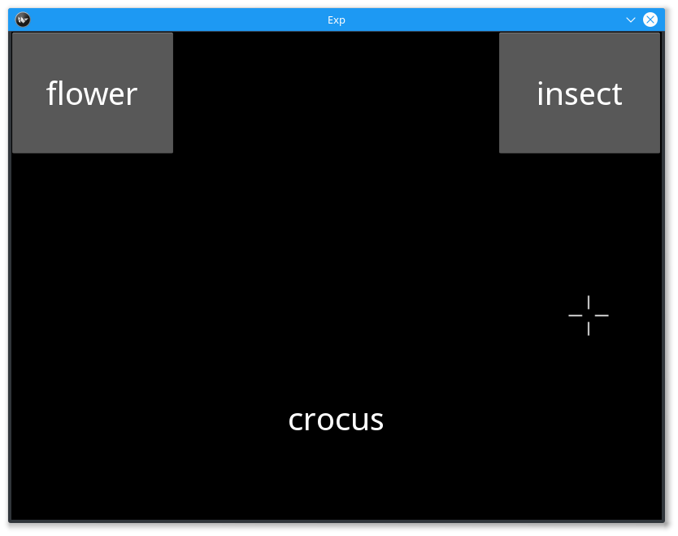

==================
IAT Mouse Tracking
==================

The IAT, or Implicit-Association Test, was introduced by Anthony Greenwald et al.
in 1998. This task is designed to get at the individual differences in our
implicit associations with different concepts that make up our lives. The basic
IAT requires the participant to rapidly categorize two target concepts with an
attribute, such that the response times will be faster with strongly associated
pairings and slower for weakly associated pairings. The key here is that
the participant should act as quickly as they can so this experiment can better
get at the implicit associations rather than the surface level associations.

The study that we are showing off in smile (Yu, Wang, Wang et al. 2012)
designed an IAT that incorporated *mouse tracking* into their study to better
get at the underlying mechanisms of implicit-association. We ask our
participants to view names of flowers, names of bugs, positively associated
nouns, and negatively associated nouns and to classify them into categories.
The blocks of stimuli will be better explained below in the **Stimulus Generation**
section of this document.

This SMILE experiment will utilize many of the *Mouse*
Classes in `mouse.py`, including :py:class:`~smile.mouse.MouseCursor` and
:py:class:`~smile.mouse.MouseRecord`. We will also be using many of the SMILE
**flow** states like :py:class:`~smile.state.Loop` and :py:class:`~smile.state.Meanwhile`
and :py:class:`~smile.state.If`. Along with the use of **Mouse** states, we will
be using :py:class:`~smile.video.ButtonPress` as our main form of input for the
experiment.

The Experiment
==============

When writing any experiment in smile, it is usually best to split it over
multiple files so that you can better organize your experiment. In this example,
we split our experiment into 3 different files, `gen_stim.py`, `config.py`, and
`iat_mouse.py`.

In `iat_mouse.py` we have the imports that we need for the experiment. Below are
those imports.

.. code-block:: python
    :linenos:

    from smile.common import *
    from config import *
    from gen_stim import *

Our experiment first imports smile.commmon, where all of the most used states
are imported from, as well as config and gen_stim. Let's take a look into config,
where we set and define our global variables for the experiment. `config.py`:

.. code-block:: python
    :linenos:

    from pathlib import Path

    # Get the directory where this script is located
    script_dir = Path(__file__).parent.absolute()

    # RST VARIABLES
    RST_FONT_SIZE = 50
    RST_WIDTH = 600

    # Read instruction files relative to the script location
    instruct1 = (script_dir / 'iat_mouse_instructions1.rst').read_text()
    instruct2 = (script_dir / 'iat_mouse_instructions2.rst').read_text()
    instruct3 = (script_dir / 'iat_mouse_instructions3.rst').read_text()
    instruct4 = (script_dir / 'iat_mouse_instructions4.rst').read_text()
    instruct5 = (script_dir / 'iat_mouse_instructions5.rst').read_text()
    instruct6 = (script_dir / 'iat_mouse_instructions6.rst').read_text()
    instruct7 = (script_dir / 'iat_mouse_instructions7.rst').read_text()

    # MOUSE MOVING VARIABLES
    WARNING_DURATION = 2.0
    MOUSE_MOVE_RADIUS = 100
    MOUSE_MOVE_INTERVAL = 0.400

    # BUTTON VARIABLES
    BUTTON_HEIGHT = 150
    BUTTON_WIDTH = 200

    # GENERAL VARIABLES
    FONT_SIZE = 40
    INTER_TRIAL_INTERVAL = 0.750

After defining our global variables, we should define our stimulus generator. In
`gen_stim.py` we define a function that generates lists of dictionaries that
represent out blocks of trials. The following is our `gen_stim.py`, where we
first set up our lists of stimuli to be pulled from.

.. code-block:: python
    :linenos:

    import random as random
    from pathlib import Path
    from typing import List, Dict
    from config import instruct1, instruct2, instruct3, instruct4, instruct5, instruct6, instruct7

    # Define file paths using Pathlib for robustness across platforms
    BASE_DIR = Path(__file__).parent.absolute()
    POOLS_DIR = BASE_DIR / "pools"

    # Paths to the text files
    FILE_INSECTS = POOLS_DIR / "insects.txt"
    FILE_FLOWERS = POOLS_DIR / "flowers.txt"
    FILE_POSITIVES = POOLS_DIR / "positives.txt"
    FILE_NEGATIVES = POOLS_DIR / "negatives.txt"

    def load_words_from_file(filename: Path) -> List[str]:
        """Helper function to load and split words from a file."""
        with filename.open("r") as f:
            words = f.read().splitlines()
        return words

    # Load the word lists
    stim_list_insects = load_words_from_file(FILE_INSECTS)
    stim_list_flowers = load_words_from_file(FILE_FLOWERS)
    stim_list_positives = load_words_from_file(FILE_POSITIVES)
    stim_list_negatives = load_words_from_file(FILE_NEGATIVES)

Next we define our `gen_blocks()` function. At the bottom of `gen_stim.py` we
also call `gen_blocks()` so our iat_mouse.py doesn't have to.

.. code-block:: python
    :linenos:

    def generate_blocks(type: int) -> List[Dict[str, any]]:
        """
        Generate the blocks for the experiment.

        Parameters:
        type (int): Indicates whether to return the critical compatible lists (type 1) 
                    or critical incompatible lists (type 2).

        Returns:
        List[Dict]: A list of dictionaries representing blocks of word pairs with instructions.
        """

        # Sample 10 words from each list
        sample_insects = random.sample(stim_list_insects, 10)
        sample_flowers = random.sample(stim_list_flowers, 10)
        sample_positives = random.sample(stim_list_positives, 10)
        sample_negatives = random.sample(stim_list_negatives, 10)

        # Block 1: Flower (left) vs Insect (right)
        block1 = {
            "left_word": "flower",
            "right_word": "insect",
            "instruct": instruct1,
            "words": ([{"correct": "right", "center_word": I} for I in sample_insects] +
                    [{"correct": "left", "center_word": F} for F in sample_flowers])
        }

        # Block 2: Positive (left) vs Negative (right)
        block2 = {
            "left_word": "positive",
            "right_word": "negative",
            "instruct": instruct2,
            "words": ([{"correct": "left", "center_word": P} for P in sample_positives] +
                    [{"correct": "right", "center_word": N} for N in sample_negatives])
        }

        # Block 3: Flower Positive (left) vs Insect Negative (right) - 5 samples each
        block3 = {
            "left_word": "flower positive",
            "right_word": "insect negative",
            "instruct": instruct3,
            "words": ([{"correct": "right", "center_word": I} for I in random.sample(sample_insects[:], 5)] +
                    [{"correct": "left", "center_word": F} for F in random.sample(sample_flowers[:], 5)] +
                    [{"correct": "left", "center_word": P} for P in random.sample(sample_positives[:], 5)] +
                    [{"correct": "right", "center_word": N} for N in random.sample(sample_negatives[:], 5)])
        }

        # Block 4: Flower Positive (left) vs Insect Negative (right) - all 10 samples
        block4 = {
            "left_word": "flower positive",
            "right_word": "insect negative",
            "instruct": instruct4,
            "words": ([{"correct": "right", "center_word": I} for I in sample_insects] +
                    [{"correct": "left", "center_word": F} for F in sample_flowers] +
                    [{"correct": "left", "center_word": P} for P in sample_positives] +
                    [{"correct": "right", "center_word": N} for N in sample_negatives])
        }

        # Block 5: Insect (left) vs Flower (right)
        block5 = {
            "left_word": "insect",
            "right_word": "flower",
            "instruct": instruct5,
            "words": ([{"correct": "left", "center_word": I} for I in sample_insects] +
                    [{"correct": "right", "center_word": F} for F in sample_flowers])
        }

        # Block 6: Insect Positive (left) vs Flower Negative (right) - 5 samples each
        block6 = {
            "left_word": "insect positive",
            "right_word": "flower negative",
            "instruct": instruct6,
            "words": ([{"correct": "left", "center_word": I} for I in random.sample(sample_insects[:], 5)] +
                    [{"correct": "right", "center_word": F} for F in random.sample(sample_flowers[:], 5)] +
                    [{"correct": "left", "center_word": P} for P in random.sample(sample_positives[:], 5)] +
                    [{"correct": "right", "center_word": N} for N in random.sample(sample_negatives[:], 5)])
        }

        # Block 7: Insect Positive (left) vs Flower Negative (right) - all 10 samples
        block7 = {
            "left_word": "insect positive",
            "right_word": "flower negative",
            "instruct": instruct7,
            "words": ([{"correct": "left", "center_word": I} for I in sample_insects] +
                    [{"correct": "right", "center_word": F} for F in sample_flowers] +
                    [{"correct": "left", "center_word": P} for P in sample_positives] +
                    [{"correct": "right", "center_word": N} for N in sample_negatives])
        }

        # Shuffle the word blocks for randomization
        for block in [block1, block2, block3, block4, block5, block6, block7]:
            random.shuffle(block['words'])

        # Return the blocks based on the type parameter
        if type == 1:
            # Critical compatible blocks
            return [block1, block2, block3, block4, block5, block6, block7]
        else:
            # Critical incompatible blocks
            return [block5, block2, block6, block7, block1, block3, block4]

    BLOCKS = generate_blocks(1)

Now we can look at the rest of `iat_mouse.py`. The following is the setup of the
block loop and the setup of the trial loop. At the beginning of each loop, you
will see a new instructions page and will not be able to go on with the experiment
until you press a key. The block loop will loop over the *BLOCKS* that were
defined in `gen_stim.py`, whereas the trial loop will loop over the *words* key
that is attached to each block's dictionary.

.. code-block:: python

    # Setup the Block loop, where *block* is a
    # Reference to the variable you are looping over
    with Loop(BLOCKS) as block:
        # Show the instructions to the participant
        RstDocument(text=block.current['instruct'], base_font_size=RST_FONT_SIZE,
                    width=RST_WIDTH, height=exp.screen.height)
        with UntilDone():
            # When a KeyPress is detected, the UntilDone
            # will cancel the RstDocument state
            KeyPress()
        # Setup a loop over each Trial in a Block. *block.current* references the
        # current iteration of the loop, which is a dictionary that contains the list
        # words. *trial* will be our reference to the current word in our loop.
        with Loop(block.current['words']) as trial:

The core of this experiment is the trial level loop. Below is the code that defines
the states that run each and every trial for the participant. This is the section
of code that defines the button press, the things that happen while
the buttons are waiting to be pressed, and the Log the logs out the information
from each trial. It also sets up the MouseRecord that tracks the mouse positions
that need to be analyzed for this experiment.

.. code-block:: python

            # initialize our testing variable in Experiment Runtime
            # exp.something = something will create a Set state
            exp.mouse_test = False
            # The following is a ButtonPress state. This state works like KeyPress,
            # but instead waits for any of the buttons that are its children to be
            # press.
            with ButtonPress(correct_resp=trial.current['correct']) as bp:
                # block.current is a dictionary that has all of the information we
                # would need during each individual block, including the text that is
                # in these buttons, which differs from block to block
                Button(text=block.current['left_word'], name="left", left=0,
                    top=exp.screen.top, width=BUTTON_WIDTH, height=BUTTON_HEIGHT, text_size=(
                        170, None),
                    font_size=FONT_SIZE, halign='center')
                Button(text=block.current['right_word'], name="right",
                    right=exp.screen.right, top=exp.screen.top,
                    width=BUTTON_WIDTH, height=BUTTON_HEIGHT, text_size=(
                        170, None),
                    font_size=FONT_SIZE, halign='center')
                # Required! To see the mouse on the screen
                MouseCursor()
            # while Those buttons are waiting to be pressed, go ahead and do the
            # children of this next state, the Meanwhile
            with Meanwhile():
                # The start button that is required to be pressed before the trial
                # word is seen.
                with ButtonPress():
                    Button(text="Start", bottom=exp.screen.bottom, font_size=FONT_SIZE)
                # Do all of the children of a Parallel at the same time.
                with Parallel():
                    # display target word
                    target_lb = Label(
                        text=trial.current['center_word'], font_size=FONT_SIZE, bottom=exp.screen.bottom+100)
                    # Record the movements of the mouse
                    MouseRecord(name="MouseMovements")
                    # Setup an invisible rectangle that is used to detect exactly
                    # when the mouse starts to head toward an answer.
                    rtgl = Rectangle(center=MousePos(), width=MOUSE_MOVE_RADIUS,
                                    height=MOUSE_MOVE_RADIUS, color=(0, 0, 0, 0))
                    with Serial():
                        # wait until the mouse leaves the rectangle from above
                        wt = Wait(until=(MouseWithin(rtgl) == False))
                        # If they waited too long to start moving, tell the experiment
                        # to display a warning message to the paricipant
                        with If(wt.event_time['time'] - wt.start_time > MOUSE_MOVE_INTERVAL):
                            exp.mouse_test = True
            with If(exp.mouse_test):
                Label(text="You are taking to long to move, Please speed up!",
                    font_size=FONT_SIZE, color="RED", duration=WARNING_DURATION)
            # wait the interstimulus interval
            Wait(INTER_TRIAL_INTERVAL)
            # WRITE THE LOGS
            Log(name="IAT_MOUSE",
                left=block.current['left_word'],
                right=block.current['right_word'],
                word=trial.current,
                correct=bp.correct,
                reaction_time=bp.press_time['time']-target_lb.appear_time['time'],
                slow_to_react=exp.mouse_test)
    # the line required to run your experiment after all
    # of it is defined above
    exp.run()

Analysis
========

When coding your experiment, you don't have to worry about losing any data
because all of it is saved out into `.slog` files anyway. The thing you do have
to worry about is whether or not you want that data easily available or if you
want to spend hours **slogging** through your data. We made it easy for you
to pick which data you want saved out during the running of your experiment with
use of the **Log** state.

Relevant data from the **IAT MOUSE TRACKING** task would be the responses from
the **ButtonPress** and the mouse movements that are saved in the `.slog` files.

If you would like to grab your data from the `.slog` files to analyze your data
in python, you need to use the :py:func:`~smile.log.log2dl`. This function will
read in all of the `.slog` files with the same base name, and convert them into
one long list of dictionaries. Below is a the few lines of code you would use to
get at all of the data from three imaginary participants, named as `s000`, `s001`,
and `s002`.

.. code-block:: python
    :linenos:

    from smile.log as lg
    #define subject pool
    subjects = ["s000/","s001/","s002/"]
    dic_list = []
    mouse_list = []
    for sbj in subjects:
        #get at all the different subjects
        dic_list.append(lg.log2dl(log_filename="data/" + sbj + "Log_IAT_MOUSE"))
        mouse_list.append(lg.log2dl(log_filename="data/" + sbj + "record_MouseMovements"))
    #print out all of the study times in the first study block for
    #participant one, block one
    print dic_list[0]['reaction_time']

You can also translate all of the `.slog` files into `.csv` files easily by
running the command :py:func:`~smile.log.log2csv` for each participant. An example of this is
located below.

.. code-block:: python
    :linenos:

    from smile.log as lg
    #define subject pool
    subjects = ["s000/","s001/","s002/"]
    for sbj in subjects:
        #Get at all the subjects data, naming the csv appropriately.
        lg.log2csv(log_filename="data/" + sbj + "Log_IAT_MOUSE", csv_filename=sbj + "_IAT_MOUSE")
        lg.log2csv(log_filename="data/" + sbj + "record_MouseMovements", csv_filename=sbj + "_IAT_MOUSE_MOVEMENTS")

iat_mouse.py in full
====================

.. code-block:: python
    :linenos:

    from smile.common import *
    from config import *
    from gen_stim import *

    # Start setting up the experiment
    exp = Experiment()

    # Setup the Block loop, where *block* is a
    # Reference to the variable you are looping over
    with Loop(BLOCKS) as block:
        # Show the instructions to the participant
        RstDocument(text=block.current['instruct'], base_font_size=RST_FONT_SIZE,
                    width=RST_WIDTH, height=exp.screen.height)
        with UntilDone():
            # When a KeyPress is detected, the UntilDone
            # will cancel the RstDocument state
            KeyPress()
        # Setup a loop over each Trial in a Block. *block.current* references the
        # current iteration of the loop, which is a dictionary that contains the list
        # words. *trial* will be our reference to the current word in our loop.
        with Loop(block.current['words']) as trial:
            # initialize our testing variable in Experiment Runtime
            # exp.something = something will create a Set state
            exp.mouse_test = False
            # The following is a ButtonPress state. This state works like KeyPress,
            # but instead waits for any of the buttons that are its children to be
            # press.
            with ButtonPress(correct_resp=trial.current['correct']) as bp:
                # block.current is a dictionary that has all of the information we
                # would need during each individual block, including the text that is
                # in these buttons, which differs from block to block
                Button(text=block.current['left_word'], name="left", left=0,
                    top=exp.screen.top, width=BUTTON_WIDTH, height=BUTTON_HEIGHT, text_size=(
                        170, None),
                    font_size=FONT_SIZE, halign='center')
                Button(text=block.current['right_word'], name="right",
                    right=exp.screen.right, top=exp.screen.top,
                    width=BUTTON_WIDTH, height=BUTTON_HEIGHT, text_size=(
                        170, None),
                    font_size=FONT_SIZE, halign='center')
                # Required! To see the mouse on the screen
                MouseCursor()
            # while Those buttons are waiting to be pressed, go ahead and do the
            # children of this next state, the Meanwhile
            with Meanwhile():
                # The start button that is required to be pressed before the trial
                # word is seen.
                with ButtonPress():
                    Button(text="Start", bottom=exp.screen.bottom, font_size=FONT_SIZE)
                # Do all of the children of a Parallel at the same time.
                with Parallel():
                    # display target word
                    target_lb = Label(
                        text=trial.current['center_word'], font_size=FONT_SIZE, bottom=exp.screen.bottom+100)
                    # Record the movements of the mouse
                    MouseRecord(name="MouseMovements")
                    # Setup an invisible rectangle that is used to detect exactly
                    # when the mouse starts to head toward an answer.
                    rtgl = Rectangle(center=MousePos(), width=MOUSE_MOVE_RADIUS,
                                    height=MOUSE_MOVE_RADIUS, color=(0, 0, 0, 0))
                    with Serial():
                        # wait until the mouse leaves the rectangle from above
                        wt = Wait(until=(MouseWithin(rtgl) == False))
                        # If they waited too long to start moving, tell the experiment
                        # to display a warning message to the paricipant
                        with If(wt.event_time['time'] - wt.start_time > MOUSE_MOVE_INTERVAL):
                            exp.mouse_test = True
            with If(exp.mouse_test):
                Label(text="You are taking to long to move, Please speed up!",
                    font_size=FONT_SIZE, color="RED", duration=WARNING_DURATION)
            # wait the interstimulus interval
            Wait(INTER_TRIAL_INTERVAL)
            # WRITE THE LOGS
            Log(name="IAT_MOUSE",
                left=block.current['left_word'],
                right=block.current['right_word'],
                word=trial.current,
                correct=bp.correct,
                reaction_time=bp.press_time['time']-target_lb.appear_time['time'],
                slow_to_react=exp.mouse_test)
    # the line required to run your experiment after all
    # of it is defined above
    exp.run()

config.py in Full
=================

.. code-block:: python
    :linenos:

    from pathlib import Path

    # Get the directory where this script is located
    script_dir = Path(__file__).parent.absolute()

    # RST VARIABLES
    RST_FONT_SIZE = 50
    RST_WIDTH = 600

    # Read instruction files relative to the script location
    instruct1 = (script_dir / 'iat_mouse_instructions1.rst').read_text()
    instruct2 = (script_dir / 'iat_mouse_instructions2.rst').read_text()
    instruct3 = (script_dir / 'iat_mouse_instructions3.rst').read_text()
    instruct4 = (script_dir / 'iat_mouse_instructions4.rst').read_text()
    instruct5 = (script_dir / 'iat_mouse_instructions5.rst').read_text()
    instruct6 = (script_dir / 'iat_mouse_instructions6.rst').read_text()
    instruct7 = (script_dir / 'iat_mouse_instructions7.rst').read_text()

    # MOUSE MOVING VARIABLES
    WARNING_DURATION = 2.0
    MOUSE_MOVE_RADIUS = 100
    MOUSE_MOVE_INTERVAL = 0.400

    # BUTTON VARIABLES
    BUTTON_HEIGHT = 150
    BUTTON_WIDTH = 200

    # GENERAL VARIABLES
    FONT_SIZE = 40
    INTER_TRIAL_INTERVAL = 0.750

gen_stim.py in Full
===================

.. code-block:: python
    :linenos:

    import random as random
    from pathlib import Path
    from typing import List, Dict
    from config import instruct1, instruct2, instruct3, instruct4, instruct5, instruct6, instruct7

    # Define file paths using Pathlib for robustness across platforms
    BASE_DIR = Path(__file__).parent.absolute()
    POOLS_DIR = BASE_DIR / "pools"

    # Paths to the text files
    # Word lists from Greenwald et al. 1998
    FILE_INSECTS = POOLS_DIR / "insects.txt"
    FILE_FLOWERS = POOLS_DIR / "flowers.txt"
    FILE_POSITIVES = POOLS_DIR / "positives.txt"
    FILE_NEGATIVES = POOLS_DIR / "negatives.txt"

    def load_words_from_file(filename: Path) -> List[str]:
        """Helper function to load and split words from a file."""
        with filename.open("r") as f:
            words = f.read().splitlines()
        return words

    # Load the word lists
    stim_list_insects = load_words_from_file(FILE_INSECTS)
    stim_list_flowers = load_words_from_file(FILE_FLOWERS)
    stim_list_positives = load_words_from_file(FILE_POSITIVES)
    stim_list_negatives = load_words_from_file(FILE_NEGATIVES)

    def generate_blocks(type: int) -> List[Dict[str, any]]:
        """
        Generate the blocks for the experiment.

        Parameters:
        type (int): Indicates whether to return the critical compatible lists (type 1) 
                    or critical incompatible lists (type 2).

        Returns:
        List[Dict]: A list of dictionaries representing blocks of word pairs with instructions.
        """

        # Sample 10 words from each list
        sample_insects = random.sample(stim_list_insects, 10)
        sample_flowers = random.sample(stim_list_flowers, 10)
        sample_positives = random.sample(stim_list_positives, 10)
        sample_negatives = random.sample(stim_list_negatives, 10)

        # Block 1: Flower (left) vs Insect (right)
        block1 = {
            "left_word": "flower",
            "right_word": "insect",
            "instruct": instruct1,
            "words": ([{"correct": "right", "center_word": I} for I in sample_insects] +
                    [{"correct": "left", "center_word": F} for F in sample_flowers])
        }

        # Block 2: Positive (left) vs Negative (right)
        block2 = {
            "left_word": "positive",
            "right_word": "negative",
            "instruct": instruct2,
            "words": ([{"correct": "left", "center_word": P} for P in sample_positives] +
                    [{"correct": "right", "center_word": N} for N in sample_negatives])
        }

        # Block 3: Flower Positive (left) vs Insect Negative (right) - 5 samples each
        block3 = {
            "left_word": "flower positive",
            "right_word": "insect negative",
            "instruct": instruct3,
            "words": ([{"correct": "right", "center_word": I} for I in random.sample(sample_insects[:], 5)] +
                    [{"correct": "left", "center_word": F} for F in random.sample(sample_flowers[:], 5)] +
                    [{"correct": "left", "center_word": P} for P in random.sample(sample_positives[:], 5)] +
                    [{"correct": "right", "center_word": N} for N in random.sample(sample_negatives[:], 5)])
        }

        # Block 4: Flower Positive (left) vs Insect Negative (right) - all 10 samples
        block4 = {
            "left_word": "flower positive",
            "right_word": "insect negative",
            "instruct": instruct4,
            "words": ([{"correct": "right", "center_word": I} for I in sample_insects] +
                    [{"correct": "left", "center_word": F} for F in sample_flowers] +
                    [{"correct": "left", "center_word": P} for P in sample_positives] +
                    [{"correct": "right", "center_word": N} for N in sample_negatives])
        }

        # Block 5: Insect (left) vs Flower (right)
        block5 = {
            "left_word": "insect",
            "right_word": "flower",
            "instruct": instruct5,
            "words": ([{"correct": "left", "center_word": I} for I in sample_insects] +
                    [{"correct": "right", "center_word": F} for F in sample_flowers])
        }

        # Block 6: Insect Positive (left) vs Flower Negative (right) - 5 samples each
        block6 = {
            "left_word": "insect positive",
            "right_word": "flower negative",
            "instruct": instruct6,
            "words": ([{"correct": "left", "center_word": I} for I in random.sample(sample_insects[:], 5)] +
                    [{"correct": "right", "center_word": F} for F in random.sample(sample_flowers[:], 5)] +
                    [{"correct": "left", "center_word": P} for P in random.sample(sample_positives[:], 5)] +
                    [{"correct": "right", "center_word": N} for N in random.sample(sample_negatives[:], 5)])
        }

        # Block 7: Insect Positive (left) vs Flower Negative (right) - all 10 samples
        block7 = {
            "left_word": "insect positive",
            "right_word": "flower negative",
            "instruct": instruct7,
            "words": ([{"correct": "left", "center_word": I} for I in sample_insects] +
                    [{"correct": "right", "center_word": F} for F in sample_flowers] +
                    [{"correct": "left", "center_word": P} for P in sample_positives] +
                    [{"correct": "right", "center_word": N} for N in sample_negatives])
        }

        # Shuffle the word blocks for randomization
        for block in [block1, block2, block3, block4, block5, block6, block7]:
            random.shuffle(block['words'])

        # Return the blocks based on the type parameter
        if type == 1:
            # Critical compatible blocks
            return [block1, block2, block3, block4, block5, block6, block7]
        else:
            # Critical incompatible blocks
            return [block5, block2, block6, block7, block1, block3, block4]

    BLOCKS = generate_blocks(1)

CITATION
========

::

    Greenwald, Anthony G.; McGhee, Debbie E.; Schwartz, Jordan L.K. (1998), "Measuring Individual Differences in Implicit Cognition: The Implicit Association Test", Journal of Personality and Social Psychology 74 (6): 1464–1480

::

    Yu, Wang, Wang (2012), "Beyond Reaction Times: Incorporating Mouse-Tracking Measures into the Implicit Association Test to Examine its Underlying Process", Social Cognition 30 (3): 289-306
