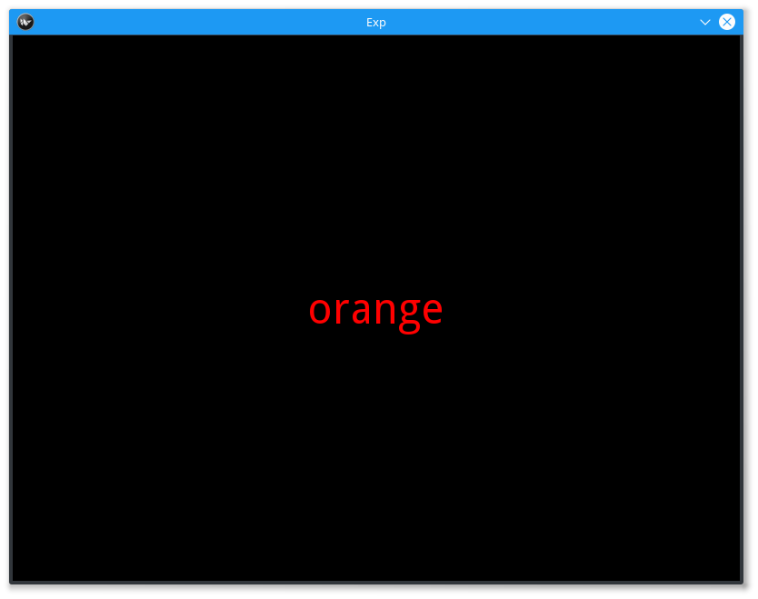

===========
Stroop Task
===========

This is the stroop task. The participant is required to view a list of words,
appearing one at a time on the screen, and say out loud the color of the text.
Each sound file corresponding to each trial are saved out as `.wav` files, with
the block and trial number in the filename.

The Experiment
==============

First, let's do the imports that we need for this experiment. We are also going
to execute the config.py file and the gen_stim.py file.

.. code-block:: python

    from smile.common import *
    from smile.audio import RecordSoundFile

    #execute both the configuration file and the
    #stimulus generation file
    from config import *
    from gen_stim import *

For this experiment we defined two functions that would generate our list of
lists of dictionaries full of the information we need to run each trial of our
experiment. The first is called `gen_lists()`. The following is `gen_stim.py`.

.. code-block:: python
    :linenos:

    def gen_lists():
        #First, let's define some variables.
        num_of_blocks = 4 #This is an arbitrary number of blocks.
        len_of_blocks = 24 #Once again, an arbitrary number of words in the block.
        total_words = num_of_blocks * len_of_blocks #The total number of words.
        dict_list = [] #The list to hold the dictionaries
        sample_list = [] #This list will hold a few dictionaries in order to provide a sample.

        """
        We will be creating dictionaries with the following keys:
            word		The actual word.
            color		The color the word will be presented as.
            matched		True or false (True if the word describes its own color, false otherwise.)

        """

        #So, now we begin to create the lists.
        for y in range (num_of_blocks):
            for x in range(len_of_blocks/8):
                block_list = []
                #This block will create the matched word/color pairs.
                r_trial = {'word':'red', 'color':'RED', 'matched':True}
                block_list.append(r_trial)
                sample_list.append(r_trial)
                b_trial = {'word':'blue', 'color':'BLUE', 'matched':True}
                block_list.append(b_trial)
                sample_list.append(b_trial)
                g_trial = {'word':'green', 'color':'GREEN', 'matched':True}
                block_list.append(g_trial)
                sample_list.append(g_trial)
                o_trial = {'word':'orange', 'color':'ORANGE', 'matched':True}
                block_list.append(o_trial)
                sample_list.append(o_trial)

                #This set of four will create the mismatched color lists.
                rf_trial = {'word':'red', 'color':randomize_color('red', x%3), 'matched':False}
                block_list.append(rf_trial)
                sample_list.append(rf_trial)
                bf_trial = {'word':'blue', 'color':randomize_color('blue', x%3), 'matched':False}
                block_list.append(bf_trial)
                sample_list.append(bf_trial)
                gf_trial = {'word':'green', 'color':randomize_color('green', x%3), 'matched':False}
                block_list.append(gf_trial)
                sample_list.append(gf_trial)
                of_trial = {'word':'orange', 'color':randomize_color('orange', x%3), 'matched':False}
                block_list.append(of_trial)
                sample_list.append(of_trial)

                #And now we shuffle the lists to ensure randomness.
                shuffle(block_list)
                dict_list.append(block_list)
        shuffle(dict_list)
        return(dict_list, sample_list)

Inside this function we call another function that we used to give us the color
of the mismatched trials. This function is called `randomize_color()`.
This function will return a string representative of the color that that text
of this trial will be. The following is the rest of `gen_stim.py`.

.. code-block:: python

    :lineno-start: 54

    #This function will essentially select a random color from blue, orange, green, and red from amongst the colors that the inputted word is not.
    def randomize_color(sColor, iColor):

        final_color = ''
        if(sColor == 'red'):
            if(iColor == 0):
                final_color = 'BLUE'
            elif(iColor == 1):
                final_color = 'ORANGE'
            else:
                final_color = 'GREEN'
        elif(sColor == 'blue'):
            if(iColor == 0):
                final_color = 'RED'
            elif(iColor == 1):
                final_color = 'GREEN'
            else:
                final_color = 'ORANGE'
        elif(sColor == 'green'):
            if(iColor == 0):
                final_color = 'ORANGE'
            elif(iColor == 1):
                final_color = 'BLUE'
            else:
                final_color = 'RED'
        elif(sColor == 'orange'):
            if(iColor == 0):
                final_color = 'RED'
            elif(iColor == 1):
                final_color = 'GREEN'
            else:
                final_color = 'BLUE'
        return final_color
    #Generate the Stimulus
    trials, sample_list = gen_lists(NUMBLOCKS, LENBLOCKS)

Now that we have our list gen setup, let's run our list gen and setup our
experiment variables. The following is `config.py`.

.. code-block:: python
    :linenos:

    #Read in the instructions
    instruct_text = open('stroop_instructions.rst', 'r').read()
    RSTFONTSIZE = 30
    RSTWIDTH = 900
    NUMBLOCKS = 4
    LENBLOCKS = 24
    recDuration = 2
    interBlockDur = 2
    interStimulusInterval = 2

Now we can start building our stroop experiment. The first line we run is
`exp = Experiment()` to tell **SMILE** that we are ready to start defining the
states in our state machine. The main states we are going to need when
presenting any stimulus, in our case :py:class:`Labels <smile.video.Label>` of text, are :py:class:`Loops <smile.state.Loop>`.
The other state will be needed is the :py:class:`~smile.state.Wait` state, to
provide a much needed slight delay in the stimulus.

Below are the first few lines of our experiment. We setup the experiment
variables and the loops that drive our experiment.

.. code-block:: python

    #Define the Experiment Variable
    exp = Experiment()

    #Show the instructions as an RstDocument Viewer on the screen
    init_text = RstDocument(text=instruct_text, font_size=RSTFONTSIZE, width=RSTWIDTH, top=exp.screen.top, height=exp.screen.height)
    with UntilDone():
        #Once you press any key, the UntilDone will cancel the RstDocument,
        #allowing the rest of the experiment to continue running.
        keypress = KeyPress()

    #Initialize the block counter, only used because we need
    #unique names for the .wav files later.
    exp.blockNum = 0

    #Initialize the Loop as "with Loop(list_like) as reference_variable_name:"
    with Loop(trials) as block:
        #Initialize the trial counter, only used because we need
        #unique names for the .wav files later.
        exp.trialNum = 0

        inter_stim = Label(text = '+', font_size = 80, duration = interBlockDur)
        #Initialize the Loop as "with Loop(list_like) as reference_variable_name:"
        with Loop(block.current) as trial:

We have now declared our 2 loops. One is to loop over our blocks, and one is to
loop over our trials in each block. We also put an inter-stimulus fixation cross
to show the participant where the stimulus will be presented. The next step is
to define how our action states will work.

.. code-block:: python

            #Display the word, with the appropriate colored text
            t = Label(text=trial.current['word'], font_size=48, color=trial.current['color'])
            with UntilDone():
                #The Label will stay on the screen for as long as
                #the RecordSoundFile state is active. The filename
                #for this state is different for each trial in each block.
                rec = RecordSoundFile(filename="b_" + Ref(str,exp.blockNum) + "_t_" + Ref(str, exp.trialNum),
                                      duration=recDuration)
            #Log the color and word that was presented on the screen,
            #as well as the block and trial number
            Log(name='Stroop', stim_word=trial.current['word'], stim_color=trial.current['color'],
                block_num=exp.blockNum, trial_num=exp.trialNum)
            Wait(interStimulusInterval)
            #Wait for a duration then present the fixation
            #cross again.
            inter_stim = Label(text = '+', font_size = 80, duration = interBlockDur)
            #Increase the trialNum
            exp.trialNum += 1
        #Increase the blockNum
        exp.blockNum += 1
    #Run the experiment!
    exp.run()

Analysis
========

The main way to analyze this data is to run all of your `.wav` files through
some kind of program that deals with sifting through the important information
that each file contains to remove errors. That info is what word they are saying
in it and how long, from the start of recording, it took them to respond. With
those two peices of information, you would be able to run stats on them along with
the data from the experiment, i.e. the color and the text of the presented item
during each trial.

How you go about getting the info from the `.wav` files might be hard, but
getting the data from SMILE and into a data-frame is fairly easy. Below is a
the few lines of code you would use to get at all of the data from all of your
participants.

.. code-block:: python
    :linenos:

    from smile.log as lg
    #define subject pool
    subjects = ["s000/","s001/","s002/"]
    dic_list = []
    for sbj in subjects:
        #get at all the different subjects
        dic_list.append(lg.log2dl(log_filename="data/" + sbj + "Log_Stroop"))
    #print out all of the stimulus words of the first subject's first trial
    print dic_list[0]['stim_word']

You can also translate all of the `.slog` files into `.csv` files easily by
running the command :py:func:`~smile.log.log2csv` for each participant. An example of this is
located below.

.. code-block:: python
    :linenos:

    from smile.log as lg
    #define subject pool
    subjects = ["s000/","s001/","s002/"]
    for sbj in subjects:
        #Get at all the subjects data, naming the csv appropriately.
        lg.log2csv(log_filename="data/" + sbj + "Log_Stroop", csv_filename=sbj + "_Stroop")

stroop.py in Full
=================

.. code-block:: python
    :linenos:

    from smile.common import *
    from smile.audio import RecordSoundFile
    from random import *
    from math import *

    #execute both the configuration file and the
    #stimulus generation file
    from config import *
    from gen_stim import *

    #Define the Experiment Variable
    exp = Experiment()

    #Show the instructions as an RstDocument Viewer on the screen
    init_text = RstDocument(text=instruct_text, font_size=RSTFONTSIZE, width=RSTWIDTH, top=exp.screen.top, height=exp.screen.height)
    with UntilDone():
        #Once you press any key, the UntilDone will cancel the RstDocument,
        #allowing the rest of the experiment to continue running.
        keypress = KeyPress()

    #Initialize the block counter, only used because we need
    #unique names for the .wav files later.
    exp.blockNum = 0

    #Initialize the Loop as "with Loop(list_like) as reference_variable_name:"
    with Loop(trials) as block:
        #Initialize the trial counter, only used because we need
        #unique names for the .wav files later.
        exp.trialNum = 0

        inter_stim = Label(text = '+', font_size = 80, duration = interBlockDur)
        #Initialize the Loop as "with Loop(list_like) as reference_variable_name:"
        with Loop(block.current) as trial:
            #Display the word, with the appropriate colored text
            t = Label(text=trial.current['word'], font_size=48, color=trial.current['color'])
            with UntilDone():
                #The Label will stay on the screen for as long as
                #the RecordSoundFile state is active. The filename
                #for this state is different for each trial in each block.
                rec = RecordSoundFile(filename="b_" + Ref(str,exp.blockNum) + "_t_" + Ref(str, exp.trialNum),
                                      duration=recDuration)
            #Log the color and word that was presented on the screen,
            #as well as the block and trial number
            Log(name='Stroop', stim_word=trial.current['word'], stim_color=trial.current['color'],
                block_num=exp.blockNum, trial_num=exp.trialNum)
            Wait(interStimulusInterval)
            #Wait for a duration then present the fixation
            #cross again.
            inter_stim = Label(text = '+', font_size = 80, duration = interBlockDur)
            #Increase the trialNum
            exp.trialNum += 1
        #Increase the blockNum
        exp.blockNum += 1
    #Run the experiment!
    exp.run()

config.py in Full
=================

.. code-block:: python
    :linenos:

    instruct_text = open('stroop_instructions.rst', 'r').read()
    RSTFONTSIZE = 30
    RSTWIDTH = 900
    NUMBLOCKS = 4
    LENBLOCKS = 24
    recDuration = 2
    interBlockDur = 2
    interStimulusInterval = 2

gen_stim.py in Full
===================

.. code-block:: python
    :linenos:

    def gen_lists(num_of_blocks, len_of_blocks):
        #First, let's define some variables.
        total_words = num_of_blocks * len_of_blocks #The total number of words.
        dict_list = [] #The list to hold the dictionaries
        sample_list = [] #This list will hold a few dictionaries in order to provide a sample.

        """
        We will be creating dictionaries with the following keys:
            word		The actual word.
            color		The color the word will be presented as.
            matched		True or false (True if the word describes its own color, false otherwise.)

        """

        #Now we begin to create the lists.
        for y in range (num_of_blocks):
            for x in range(len_of_blocks/8):
                block_list = []
                #This block will create the matched word/color pairs.
                r_trial = {'word':'red', 'color':'RED', 'matched':True}
                block_list.append(r_trial)
                sample_list.append(r_trial)
                b_trial = {'word':'blue', 'color':'BLUE', 'matched':True}
                block_list.append(b_trial)
                sample_list.append(b_trial)
                g_trial = {'word':'green', 'color':'GREEN', 'matched':True}
                block_list.append(g_trial)
                sample_list.append(g_trial)
                o_trial = {'word':'orange', 'color':'ORANGE', 'matched':True}
                block_list.append(o_trial)
                sample_list.append(o_trial)

                #This set of four will create the mismatched color lists.
                rf_trial = {'word':'red', 'color':randomize_color('red', x%3), 'matched':False}
                block_list.append(rf_trial)
                sample_list.append(rf_trial)
                bf_trial = {'word':'blue', 'color':randomize_color('blue', x%3), 'matched':False}
                block_list.append(bf_trial)
                sample_list.append(bf_trial)
                gf_trial = {'word':'green', 'color':randomize_color('green', x%3), 'matched':False}
                block_list.append(gf_trial)
                sample_list.append(gf_trial)
                of_trial = {'word':'orange', 'color':randomize_color('orange', x%3), 'matched':False}
                block_list.append(of_trial)
                sample_list.append(of_trial)

                #And now we shuffle the lists to ensure randomness.
                shuffle(block_list)
                dict_list.append(block_list)
        shuffle(dict_list)
        return(dict_list, sample_list)

    #This function will essentially select a random color from blue, orange, green, and red from amongst the colors that the inputted word is not.
    def randomize_color(sColor, iColor):

        final_color = ''
        if(sColor == 'red'):
            if(iColor == 0):
                final_color = 'BLUE'
            elif(iColor == 1):
                final_color = 'ORANGE'
            else:
                final_color = 'GREEN'
        elif(sColor == 'blue'):
            if(iColor == 0):
                final_color = 'RED'
            elif(iColor == 1):
                final_color = 'GREEN'
            else:
                final_color = 'ORANGE'
        elif(sColor == 'green'):
            if(iColor == 0):
                final_color = 'ORANGE'
            elif(iColor == 1):
                final_color = 'BLUE'
            else:
                final_color = 'RED'
        elif(sColor == 'orange'):
            if(iColor == 0):
                final_color = 'RED'
            elif(iColor == 1):
                final_color = 'GREEN'
            else:
                final_color = 'BLUE'
        return final_color
    #Generate the Stimulus
    trials, sample_list = gen_lists(NUMBLOCKS, LENBLOCKS)
	
CITATION
========

::

	Stroop, J.R. (1935), "Studies of interference in serial verbal reactions", Journal of Experimental Psychology 18 (6): 643–662