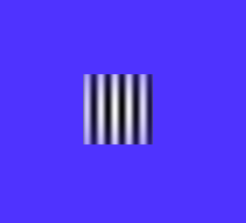
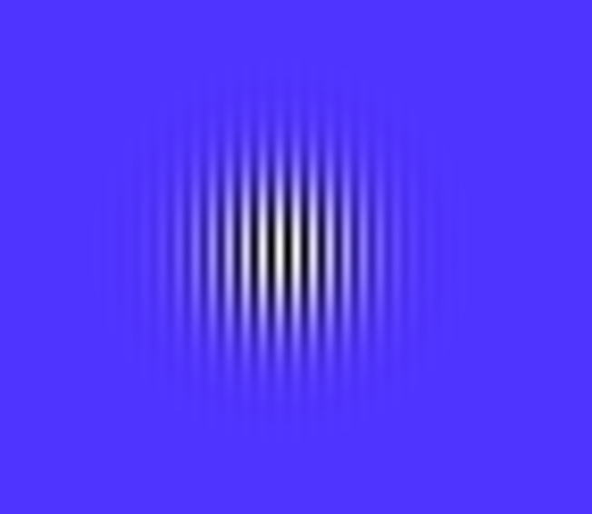
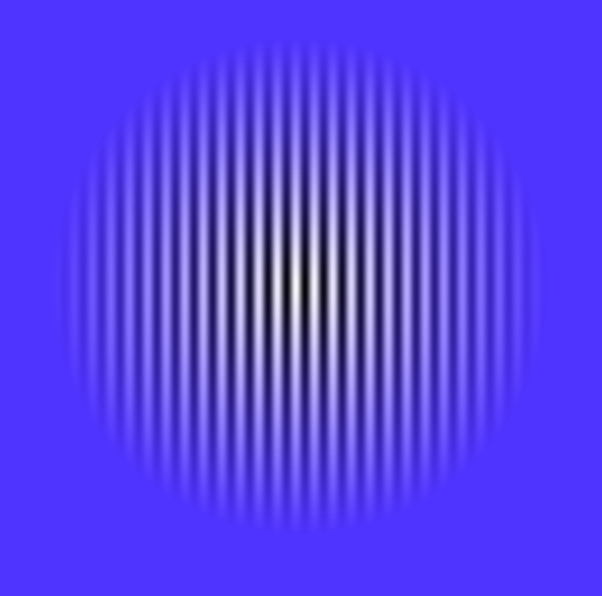
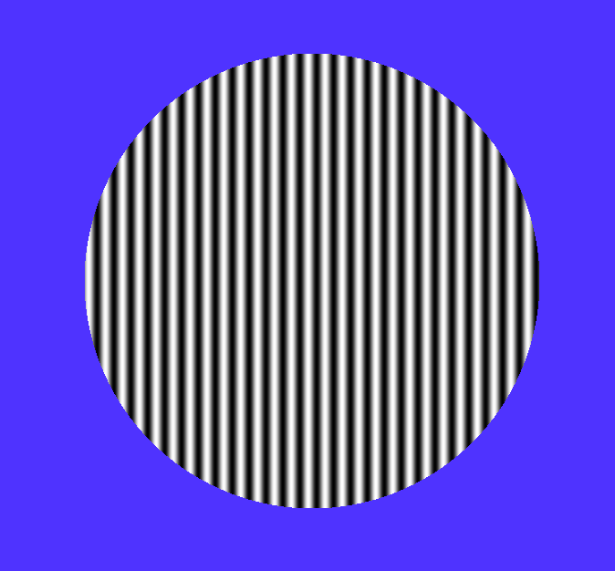
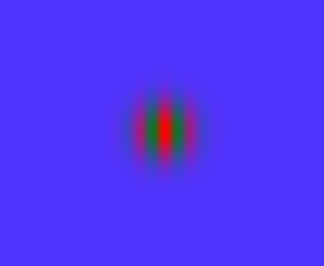

The following example, grating.py will be examined. A program was written to
produce a Gabor filter in a window.

Here is the definition of our *Grating*:

.. code-block:: python

  @WidgetState.wrap
  class Grating(Widget):
      """Display a Grating
      *Only renders square sized grating textures*

      Parameters
      ----------
      color_one : list
          rgba the Grating will oscillate between
      color_two : list
          rgba the Grating will oscillate between
      envelope : string
          type of Grating to be generated
      frequency : float
          frequency of sign wave of Grating
      phase : float
          the phase shift of the sin wave
      std_dev : integer
          the standard deviation of sin wave

      """

      envelope = StringProperty('g')
      frequency = NumericProperty(20)
      std_dev = NumericProperty(None)
      phase = NumericProperty(0.0)
      color_one = ListProperty([1., 1., 1., 1.])
      color_two = ListProperty([0., 0., 0., 1.])

In *Grating* several different parameters are needed to be passed into the
`__init__` method in order to create different kinds of Gabor filters.

- envelope : A string that instructs the program to create a Gaussian, linear, or
             circular filter

- frequency : An integer value that controls the frequency of the grating's wave

- std_dev : An integer value that controls the size of the standard deviation of
            the mask. (The larger the value, the more transparent the mask will be)

- phase : a float value that controls the phase shift of the grating's wave

- color_one : a list of values each ranging from zero to one which represents RGB
              coloring and designates one of the colors the grating oscillates between.

- color_two : a list of values each ranging from zero to one which represents RGB
              coloring and designates the other color the grating oscillates between.

Next, the '__init__' method is declared for the 'Grating' widget:

.. code-block:: python

  def __init__(self, **kwargs):
      super(type(self), self).__init__(**kwargs)

      if self.std_dev is None:
          self.std_dev = (self.width/2) * 0.1

      self._texture = None
      self._mask_texture = None

      self.bind(envelope=self._update_texture,
                std_dev=self._update_texture,
                phase=self._update_texture,
                color_one=self._update_texture,
                color_two=self._update_texture,
                frequency=self._update_texture,
                pos=self._update,
                size=self._update_texture)
      self._update_texture()

The `.bind()` method will bind each different attribute of the Gabor filter to a
method callback that might want to run if any of those attributes change.
An example of this is if, in SMILE, an :py:class:`~smile.video.UpdateWidget'
state is created where it updates a **Grating** attribute, e.g. `std_dev` attribute.
The attribute change will cause Kivy to callback the corresponding function
attached with `.bind()`. Also, take note of the cache functionality of the Grating
stimuli, to increase speed and efficiency of the code. Now the functions can be defined:

.. code-block:: python

    #Performs the calculation for the mask
    def _calc_mask(self, rx, ry):
        dx = rx - (self.width/2)   # horizontal center of Grating
        dy = ry - (self.height/2)  # vertical center of Grating

        t = math.atan2(dy, dx)
        radius = math.sqrt(dx ** 2 + dy ** 2)
        ux = radius * math.cos(t)
        uy = radius * math.sin(t)
        #Gaussian Gabor stimuli calculations
        if self.envelope[0].lower() == 'g':
            transparency = math.exp(-0.5 * (ux / (self.std_dev*3)) ** 2 - 0.5 *
                         (uy / (self.std_dev*3)) ** 2)
        #Linear Gabor stimuli calculations
        elif self.envelope[0].lower() == 'l':
            transparency = max(0, (0.5 * self.width - radius) / (0.5 * self.width))
        #Circular Gabor stimuli calculations
        elif self.envelope[0].lower() == 'c':
            if (radius > 0.5 * self.width):
                transparency = 0.0
            else:
                transparency = 1.0
        else:
            transparency = 1.0
        transparency = 1.0 - transparency
        #Return
        return 0, 0, 0, transparency

    #Performs the calculation for the grating behind the mask
    def _calc_color(self, x):
        #Creation of the sin wave for the grating texture
        amp = 0.5 + 0.5 * math.sin((x*math.pi/180) * self.frequency + self.phase)
        #RGB color return
        return [(self.color_one[0] * amp + self.color_two[0] * (1.0 - amp)),
                (self.color_one[1] * amp + self.color_two[1] * (1.0 - amp)),
                (self.color_one[2] * amp + self.color_two[2] * (1.0 - amp))]

    #Updates textures by calling update functions
    def _update_texture(self, *pargs):
        self._update_grating()
        if self._mask_texture is None or \
           self.size != self._prev_size or \
           self.std_dev != self._prev_std_dev:
            self._update_mask()
            self._prev_size = self.size
            self._prev_std_dev = self.std_dev
        self._update()

    #Updates the drawling of the textures on screen
    def _update(self, *pargs):
        # clear (or else we get gratings all over)
        self.canvas.clear()

        # set up the blending
        with self.canvas.before:
            Callback(self._set_blend_func)

        # Draw the two textures in rectangles
        with self.canvas:
            # draw the mask
            mask = Rectangle(size=self.size, pos=self.pos,
                             texture=self._mask_texture)
            #repeats 4 times to fill the created texture rectangle
            mask.tex_coords = 0, 0, 2, 0, 2, 2, 0, 2

            # draw the grating
            grating = Rectangle(size=self.size, pos=self.pos,
                                texture=self._texture)
            #repeats the grating to fill the texture rectangle
            grating.tex_coords = (0, 0, self.width/self._period,
                                  0, self.width/self._period,
                                  self.height, 0, self.height)

        # clean up the blending
        with self.canvas.after:
            Callback(self._reset_blend_func)

    #Update grating variables
    def _update_grating(self, *args):
        # calculate the num needed for period
        self._period = int(round(360./self.frequency))

        # make new texture
        self._texture = Texture.create(size=(self._period, 1),
                                       colorfmt='rgb',
                                       bufferfmt='float')

        # fill the buffer for the texture
        grating_buf = list(chain.from_iterable([self._calc_color(x)
                                                for x in range(self._period)]))
        # make an array from the buffer
        grating_arr = array('f', grating_buf)

        # blit the array to the texture
        self._texture.blit_buffer(grating_arr, colorfmt='rgb',
                                  bufferfmt='float')

        # set it to repeat
        self._texture.wrap = 'repeat'
        BindTexture(texture=self._texture, index=0)

    #Update Mask variables
    def _update_mask(self, *args):
        #creation of texture, half the width and height, will be reflected to
        #completely cover the grating texture
        self._mask_texture = Texture.create(size=(self.width/2, self.height/2),
                                            colorfmt='rgba')

        # generate a unique mask id for cache lookup
        mask_id = 'e%s_w%d_h%d'%(self.envelope, self.width, self.height)
        global _mask_cache

        try:
            # see if we've already created this mask
            mask_arr = _mask_cache[mask_id]
        except KeyError:
            # set mask (this is the slow part)
            mask_buf = list(chain.from_iterable([self._calc_mask(rx, ry)
                                                 for rx in range(self.width/2)
                                                 for ry in range(self.height/2)]))
            # turn into an array
            mask_arr = array('f', mask_buf)

            # add it to the cache
            _mask_cache[mask_id] = mask_arr

        # blit it
        self._mask_texture.blit_buffer(mask_arr, colorfmt='rgba',
                                       bufferfmt='float')
        #mask is mirrored and repeated
        self._mask_texture.wrap = 'mirrored_repeat'
        #mask is set to foremost texture
        self._mask_texture.mag_filter = 'nearest'
        BindTexture(texture=self._mask_texture, index=1)

      #Update Mask variables
      def _update_mask(self, *args):
          #creation of texture, half the width and height, will be reflected to
          #completely cover the grating texture
          self._mask_texture = Texture.create(size=(self.width/2, self.height/2),
                                              colorfmt='rgba')

          # generate a unique mask id for cache lookup
          mask_id = 'e%s_w%d_h%d'%(self.envelope, self.width, self.height)
          global _mask_cache

          try:
              # see if we've already created this mask
              mask_arr = _mask_cache[mask_id]
          except KeyError:
              # set mask (this is the slow part)
              mask_buf = list(chain.from_iterable([self._calc_mask(rx, ry)
                                                   for rx in range(self.width/2)
                                                   for ry in range(self.height/2)]))
              # turn into an array
              mask_arr = array('f', mask_buf)

              # add it to the cache
              _mask_cache[mask_id] = mask_arr

          # blit it
          self._mask_texture.blit_buffer(mask_arr, colorfmt='rgba',
                                         bufferfmt='float')
          #mask is mirrored and repeated
          self._mask_texture.wrap = 'mirrored_repeat'
          #mask is set to foremost texture
          self._mask_texture.mag_filter = 'nearest'
          BindTexture(texture=self._mask_texture, index=1)

The *Grating* widget works step-wise to create a Gabor filter. First, it creates
a grating based on the '_calc_color' function. The function creates an oscillating
grating between two chosen colors(using color_one and color_two variables), or the default
black and white color. The frequency of oscillation and the phase of oscillation can be
controlled by the phase and frequency variables, as well.

The next step of the program is to create the overlaying mask. The purpose of the
mask is to layer over the grating texture so a fading/blending to the background
can occur. Two envelope values can be passed to have a gradient fade/blend to
background. These variables are setting the envelope to 'gaussian' or 'linear'.
The other variable, 'circular', when set to envelope, makes a circular mask overlay
with no fading/blending to the background. The characteristics of the mask can be
changed with the std_dev variable. This numeric value, when increased, causes the
mask to increase in size, making the background grating texture appear larger on
screen. Conversely, when the std_dev variable is set to smaller numeric values, the
grating will appear smaller on screen. The default value for the std_dev variable is
set at 20.

The *Grating* widget also uses special openGL functionality. The last two functions
of the class control how the alpha values of the mask interact with the program.
.. code-block:: python

    #Controller for the Gabor blending to the background color
    #glBlendFunc(starting RGBA values, desired RGBA values)
    def _set_blend_func(self, instruction):
        glBlendFunc(GL_ONE_MINUS_DST_ALPHA, GL_SRC_ALPHA)

    #Reset of the Gabor blending properties for creation of new stimuli
    #glBlendFunc(starting RGBA values, desired RGBA values)
    def _reset_blend_func(self, instruction):
        glBlendFunc(GL_SRC_ALPHA, GL_ONE_MINUS_SRC_ALPHA)

These two functions make the increasing alpha values of the grating's mask to
blend in with the background, rather than turning black. The second function resets,
or turns off this functionality once finished with the mask.

Examples of Gabor Filters
=========================

Grating()
When passing no parameters into the Grating widget, the return is a grated box,
oscillating between black and white:

Grating(width=500, height=500, envelope='gaussian')
When passing width, height, and envelope parameters, notice the sizing of the Gabor
filter changes and how the style of the mask changes:

Grating(width=500, height=500, envelope='linear')
This is the same parameters as the above example except the envelop is now 'linear',
notice how the mask changes:

Grating(width=500, height=500, envelope='Circular')
This is the same parameters as the above example except the envelop is now 'Circular',
notice how the mask changes:

Grating(width=500, height=500, envelope='gaussian', phase=1.5, frequency=10)
This is the same parameters as the above example except the envelop is now 'gaussian'.
Also, the phase and frequency have changed, which changes the look of the grating
behind the mask:

Grating(width=500, height=500, envelope='gaussian', phase=1.5, frequency=10,
        std_dev=10, color_one='green', color_two='red')
This is the same parameters as the above example except the colors have changed.
The colors can either be set by changing 3 list values between zero and one or
by using plain English color terms. Also, the std_dev has been set to a smaller
value, making the grating smaller due to the mask being smaller:

*See grating.py for complete Gabor filter creation code.*
