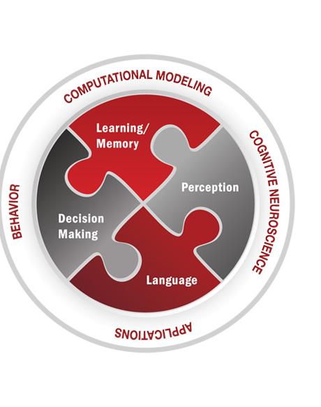

What is SMILE?
==============

.. image:: _static/smile_example.png
    :width: 375
    :height: 241
    :align: right

SMILE is the State Machine Interface Library for Experiments. The goal when
developing SMILE was to create an east-to-use experiment building library
that allows for millisecond-accurate timing. SMILE was written so that the end
user doesn't have to worry about the intricacies of timing, event handling, or
logging data.

Inspired by the concept of a state machine, SMILE works by storing the current
status of releveant input events, then initiating an action depending on a
predetermined set of rules. With the support of the versatile **Python**
programming language and **Kivy**, a module create for video game development,
SMILE is powerful and flexible while still being simple to use.

What does a SMILE experiment look like?
=======================================

Below is hello.py, an example of what the simplest SMILE experiment looks like:

.. code-block:: python

    from smile.common import *

    exp = Experiment()

    Label(text="Hello, World!", duration=5)

    exp.run()

In order to run this experiment from a computer that has SMILE installed, you
would use your favorite OS's command prompt and run the following line:

::

    >> python hello.py -s SubjectID

This program creates a full-screen window with a black background and the words
**Hello, World!** in white text in the center--just like that, we are SMILEing!

Now let us go through our SMILE experiment line by line and see what each of
them does.

**First** is the line *exp = Experiment()*. This line is the initialization line
for SMILE. This tells SMILE that it should prepare to see states being declared.

**Second** is the line *Label(text="Hello, World!", duration=5)*. **Label** is a
SMILE visual state that displays text onto the screen. Certain SMILE states take
a *duration*, and we are setting this state's duration to **5**. This means the
state will remain active on the screen for 5 seconds.

**Third** is the line *exp.run()*. This line signals to SMILE that you have finished
building your experiment and that it is ready to run. SMILE will then run your
experiment from start to finish and exit the experiment window when it has
finished.

Whats Next?
===========

To help you get ready to SMILE, the first section of this documentation is the
SMILE installation and the installation of its dependencies. After that is a
section that delves deeper into SMILE and how to write more complicated
experiments.

.. toctree::
   :maxdepth: 1

   install
   tutorial
   smile_states
   tutorial_2
   real_examples
   accessing_data
   advanced_smile
   seeking_help
   smile

Funding Sources
===============

Development of SMILE made possible by grants from:

