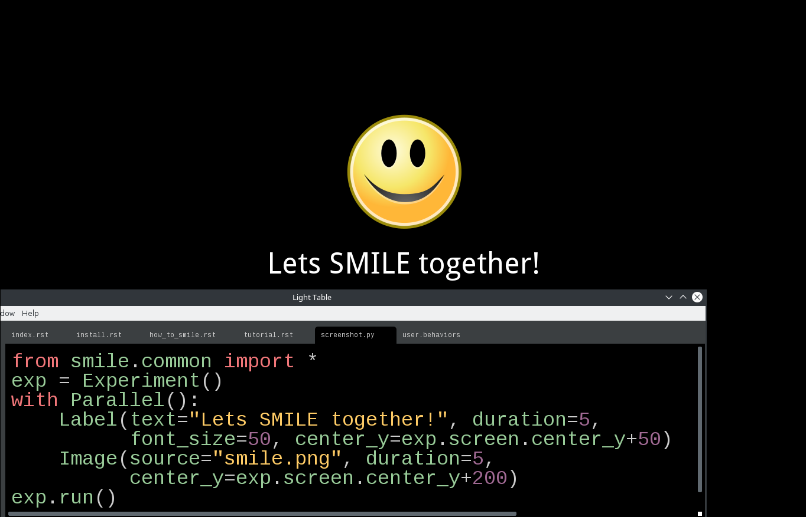

.. SMILE documentation master file, created by
   sphinx-quickstart on Thu Feb  4 13:17:50 2016.
   You can adapt this file completely to your liking, but it should at least
   contain the root `toctree` directive.

What is SMILE?
==============

SMILE is a State Machine Interface Library for Experiments. In broad terms, a
state machine is an abstract device that stores the current status of relevant
input events, then initiates an action depending on a predetermined set of
rules. The goal of a state machine is to build objects that can be in many
possible states and to define the rules for transitioning from one of those
states to another. A common example used to describe a state machine is
a stoplight: in this case, the three possible states are a red state, a green
state, and a yellow state. There is a set order of cycling through these
states; specifically, red transition so green, green transitions to yellow, and
yellow cycles back to red.

The goal of SMILE was to create an easy to use State Machine Interface where
the hardest part about coding an experiment would be the stimulus list
generation. Through SMILE, we have developed a state machine interface between
the experimenter and Kivy, a python library that specializes in creating and
displaying stimulus on the screen in the form of widgets. With SMILE, you are
able to build a Psychology experiment without the hassle of handling any of the
timing, the logging of data, or the presenting of stimulus. SMILE is considered
to be a hierarchical state machine.  This is because all of the states in
SMILE have a parent-child relationship that comes into play when dealing with
the timing of multiple states at the same time.

.. toctree::
   :maxdepth: 1

   install
   how_to_smile
   tutorial
   real_examples
   accessing_data
   smile

Indices and tables
==================

* :ref:`genindex`
* :ref:`modindex`
* :ref:`search`

