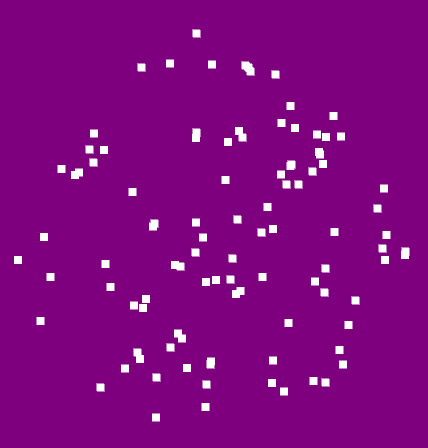
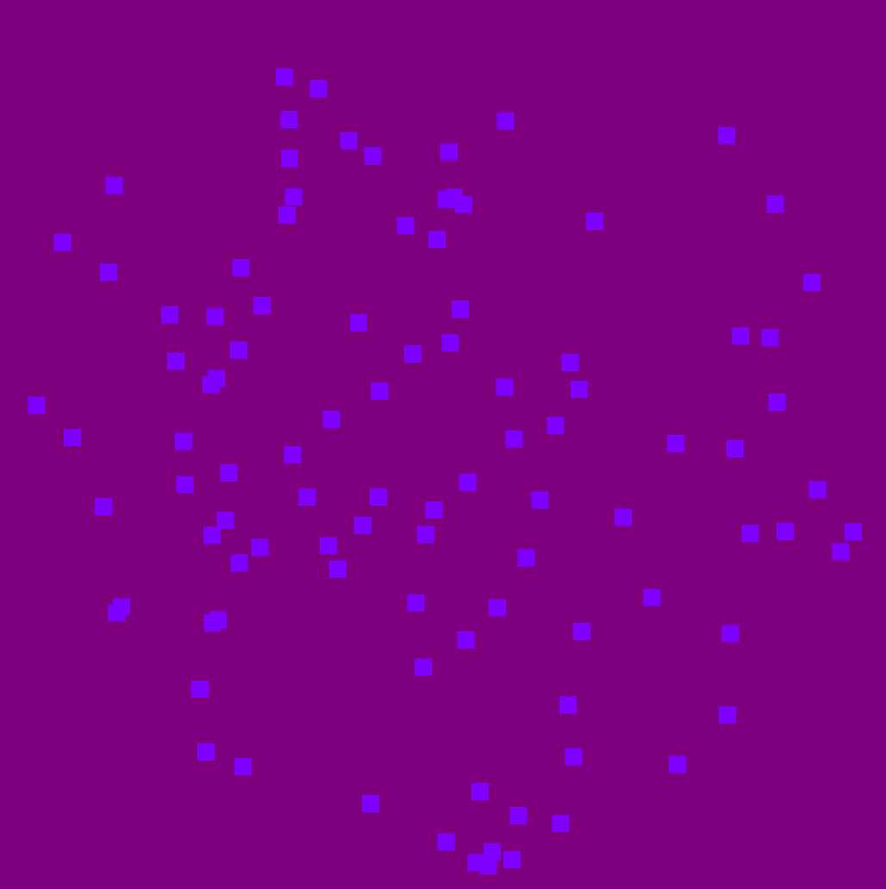
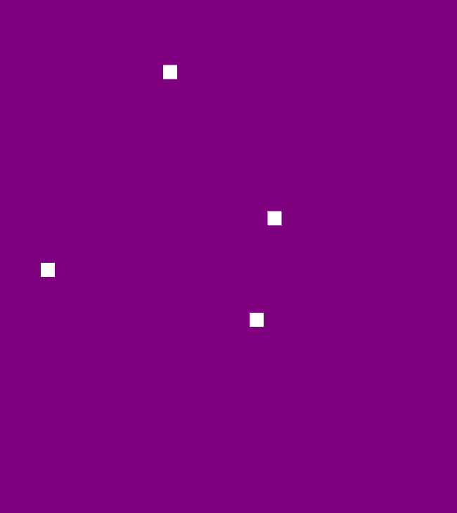

The following example, moving_dots.py will be examined. A program was written
to display the capabilities of the MovingDots stimulus.

Here is the definition of our *MovingDots*:

.. code-block:: python
class _MovingDotsWidget(Widget):
    """
    Moving dot (random dot motion) stimulus.

    Parameters
    ----------
    num_dots : int
        Number of dots active at one time.
    scale : int
        Size in pixels of the dots (really squares)
    radius : int
        Radius of the circle holding the dots.
    lifespan : float
        Mean life of each dot.
    lifespan_variance : float
        Range around the mean lifespan.
    speed : float
        Mean speed of the dots.
    speed_variance : float
        Range around the mean speed.
    coherence : float
        Proportion of dots going in a coherent direction.
        1-coherence will go in random directions.
    direction : float
        Mean direction of the coherent dots in degrees.
    direction_variance : float
        Range around the mean direction.
    color : list
        Color of the dots.
    update_interval : float
        Rate of updating dot locations.
    motion_props : list of dicts
        List of properties governing dot motion.
    """

    motion_props = ListProperty([{}])
    num_dots = NumericProperty(100)
    scale = NumericProperty(4.0)
    radius = NumericProperty(200)
    lifespan = NumericProperty(.75)
    lifespan_variance = NumericProperty(0.5)
    speed = NumericProperty(100.)
    speed_variance = NumericProperty(0)
    coherence = NumericProperty(.5)
    direction = NumericProperty(0)
    direction_variance = NumericProperty(0)
    color = ListProperty([1., 1., 1., 1.])
    update_interval = NumericProperty(1. / 30.)

    def __init__(self, **kwargs):
        super(type(self), self).__init__(**kwargs)
        # set the width and height from radius
        self.width = self.radius * 2
        self.height = self.radius * 2

        # grab default motion params
        default_params = {"radius": self.radius,
                          "scale": self.scale,
                          "color": self.color,
                          "direction": self.direction,
                          "direction_variance": self.direction_variance,
                          "speed": self.speed,
                          "speed_variance": self.speed_variance,
                          "lifespan": self.lifespan,
                          "lifespan_variance": self.lifespan_variance,
                          "coherence": self.coherence}

        # determine distribution of dots
        tot_coh = 0
        self.__dots = []

        # first create the coherent dots
        for mprop in self.motion_props:
            current_params = default_params.copy()
            current_params.update(mprop)
            num_coh = int(self.num_dots * current_params['coherence'])
            tot_coh += num_coh
            self.__dots.extend([Dot(**current_params)
                                for i in xrange(num_coh)])

        # calc the number random coh
        num_rand = self.num_dots - tot_coh
        if num_rand < 0:
            raise ValueError('Total coherence must be less than 1.0.')

        # now append the non-coh
        if num_rand > 0:
            # there are dots left to place based on the defaults
            current_params = default_params.copy()
            current_params['direction'] = 0.0
            current_params['direction_variance'] = 360
            self.__dots.extend([Dot(**current_params)
                                for i in xrange(num_rand)])

        # shuffle that list
        random.shuffle(self.__dots)

        # prepare to keep track of updates
        self._dt_avg = 0.0
        self._avg_n = 0.0

        # not currently running
        self._active = False

In *MovingDots*, several different parameters can be passed into the
`__init__` method in order to create different kinds of MovingDots stimuli.

- motion_props : A list of dictionaries that functions by first adding a "coherence"
                 dictionary key and an integer value associated with the coherence.
                 After the coherence key and value are set, any variable can be
                 added to the dictionary as a string then an integer value.
                 Multiple dictionaries can be created as long as the total value
                 of coherence is less than or equal to 1.0. An example of this
                 extended functionality can be seen later on.

- num_dots : An integer value that controls the amount of dots on screen at a time

- scale : An integer value that controls the size in pixels of the dots

- radius : An integer value that controls the radius of the circle where the dots are
           generated and exist in

- lifespan : A float value that controls the mean of how long a dot exists in seconds.

- lifespan_variance : A float value that controls the variance or range around the mean
                      of the lifespan. Example: if the lifespan is 1. second, and
                      the lifespan_variance is 0.5 second, the average dot will
                      last for 1. second. A dot could last for 1.5 seconds
                      or 0.5 seconds but that is less likely.

- speed : A float value that controls the mean of how fast or slow a dot moves on screen.

- speed_variance : A float value that controls the variance or range around the mean
                   of the speed value. Example: if the speed is 1., and
                   the speed_variance is 0.5 second, the average dot will
                   move for 1. units/second. A dot could move for 1.5
                   units/seconds or 0.5 units/seconds but that is less likely.

- coherence : A float value that controls the proportion of dots that cohere to a
              a set direction. A coherence of 0 will result in dots being generated
              and moving in completely random direction. A coherence of 0.5 will
              result in half of the dots moving in the direction set by the
              'direction' variable. A coherence of 1.0 will result in all of the
              dots moving in the direction set by the 'direction' variable.

- direction : A float value that controls the mean direction of the coherent dots
              in degrees.

- direction_variance : A float value that controls the variance or range around
                       the mean of the direction of the coherent dots. Example:
                       if the direction is 0., coherence is 1. and the direction_variance
                       is 0, all of the moving dots will move to the immediate right.
                       If the direction is 0., the coherence is 1., and the
                       direction_variance is 90, the mean of the dot direction
                       will be to the right, while some will go directly up, and
                       some will go directly down. The likelihood of a dot moving,
                       in a different direction other than to the immediate right
                       will become less likely the further away it becomes.

- color : a list of 3 values each ranging from zero to one which represents RGB
          coloring of the dots.

- update_interval : A float value that controls the rate of updating dot locations.

Next, the '__init__' method is declared for the 'MovinDots' widget:

.. code-block:: python
  def __init__(self, **kwargs):
      super(type(self), self).__init__(**kwargs)
      # set the width and height from radius
      self.width = self.radius * 2
      self.height = self.radius * 2

      # grab default motion params
      default_params = {"radius": self.radius,
                        "scale": self.scale,
                        "color": self.color,
                        "direction": self.direction,
                        "direction_variance": self.direction_variance,
                        "speed": self.speed,
                        "speed_variance": self.speed_variance,
                        "lifespan": self.lifespan,
                        "lifespan_variance": self.lifespan_variance,
                        "coherence": self.coherence}

      # determine distribution of dots
      tot_coh = 0
      self.__dots = []

      # first create the coherent dots
      for mprop in self.motion_props:
          current_params = default_params.copy()
          current_params.update(mprop)
          num_coh = int(self.num_dots * current_params['coherence'])
          tot_coh += num_coh
          self.__dots.extend([Dot(**current_params)
                              for i in xrange(num_coh)])

      # calc the number random coh
      num_rand = self.num_dots - tot_coh
      if num_rand < 0:
          raise ValueError('Total coherence must be less than 1.0.')

      # now append the non-coh
      if num_rand > 0:
          # there are dots left to place based on the defaults
          current_params = default_params.copy()
          current_params['direction'] = 0.0
          current_params['direction_variance'] = 360
          self.__dots.extend([Dot(**current_params)
                              for i in xrange(num_rand)])

      # shuffle that list
      random.shuffle(self.__dots)

      # prepare to keep track of updates
      self._dt_avg = 0.0
      self._avg_n = 0.0

      # not currently running
      self._active = False

The widget functions by first creating an amount of Dot objects that is directly
related to the proportion of coherent dots to the total amount of dots
(coherent dots / total dots). This creates an amount of dots that will cohere to
the desired directionality provided by that parameters. Next, if there are any
remaining dots to be created(total dots - (coherent dots / total dots)). The dots
will be created in random directions. The Dots class is as follows:

.. code-block:: python
  class Dot(object):
      def __init__(self, radius=100, scale=1.0,
                   color=[1.0, 1.0, 1.0, 1.0],
                   direction=0, direction_variance=0.0,
                   speed=1.0, speed_variance=0.0,
                   lifespan=.02, lifespan_variance=0.0, **kwargs):

          # process the input vars
          self.radius = radius
          self.scale = scale
          self.color = color
          self.direction = direction
          self.direction_variance = direction_variance
          self.speed = speed
          self.speed_variance = speed_variance
          self.lifespan = lifespan
          self.lifespan_variance = lifespan_variance

          # call reset to initialize the dot loc and dir
          self.reset()

      def update(self, passed_time):
          # update the lifetime
          self.current_time += passed_time

          # reset if past lifetime
          if self.current_time > self.total_time:
              # reset
              self.reset()
              return self.x, self.y

          # update the location
          self.x += self.velocity_x * passed_time
          self.y += self.velocity_y * passed_time

          # reset if outside radius
          if math.sqrt((self.x * self.x) + (self.y * self.y)) > self.radius:
              # must reset
              self.reset()
              return self.x, self.y

          # return x and y
          return self.x, self.y

      def reset(self):
          # determine new location
          t = 2 * math.pi * random.random()
          u = random.random()+random.random()
          if u > 1:
              r = 2-u
          else:
              r = u
          self.x = (self.radius * r * math.cos(t))
          self.y = (self.radius * r * math.sin(t))
          self.start_x = self.x
          self.start_y = self.y

          # process the movement direction
          angle = random_variance(self.direction*math.pi/180,
                                  self.direction_variance*math.pi/180)
          speed = random_variance(self.speed, self.speed_variance)
          self.velocity_x = speed * math.cos(angle)
          self.velocity_y = speed * math.sin(angle)

          # set the time
          self.current_time = 0.0
          self.total_time = random_variance(self.lifespan,
                                            self.lifespan_variance)
The class contains calculations that spawn a dot and move the dots after each update.
The update method in the class controls the movement of the dots by returning the
new position (x and y coordinate) of the dot every time the update method is called.
The reset method determines the new location of the dot to be spawned at after
the dot surpassed its lifespan or has moved beyond the "holding" circle.
Now the functions of the widget can be defined:
.. code-block:: python
  def start(self):
      Clock.schedule_once(self._update, self.update_interval)
      self._active = True

  def stop(self):
      self._active = False

  def _update(self, dt):
      # update the dt_avg
      self._avg_n += 1.0
      self._dt_avg += (dt - self._dt_avg) / self._avg_n

      # advance time and locs for all dots
      bases = (self.x + self.scale, self.y+self.scale)
      locs = [bases[i % 2]+p+self.radius
              for i, p in enumerate(chain.from_iterable([d.update(dt)
                                                         for d in
                                                         self.__dots]))]

      # draw the dots
      self.canvas.clear()
      with self.canvas:
          # set the dot color
          Color(*self.color)

          # draw all the dots at their current locations
          Point(points=locs, pointsize=self.scale)

      # schedule next update
      if self._active:
          Clock.schedule_once(self._update, self.update_interval)

  @property
  def refresh_rate(self):
      return 1.0 / self._dt_avg

The main function of the widget clears the canvas and redraws the moving dots with
Point().

Examples of MovingDots
======================

MovingDots()
When passing no parameters into the MovingDots widget, the return is defaults of
the program. Mainly, 100 dots with 50% of them moving to the right while the other
move randomly. The color is white, the scale is 4.0, and the radius is 200. More
information on the default variables can be seen above.

MovingDots(radius=500, color=[.5, 0., 1.], scale=10.0)
When passing radius, color, and scale parameters, notice the size of the MovingDots
widget gets larger, the color changed to blue, and the dots became larger:

MovingDots(radius=300, scale=10,num_dots=4,
           motion_props=[{"coherence": 0.25, "direction": 0,
                          "direction_variance": 0},
                         {"coherence": 0.25, "direction": 90,
                          "direction_variance": 0},
                         {"coherence": 0.25, "direction": 180,
                          "direction_variance": 0},
                         {"coherence": 0.25, "direction": 270,
                          "direction_variance": 0}])
This is example shows the utilization of motion_props to extend the functionality
of the MovingDots. The radius, scale, and number of dots are set to 300, 10, and 4,
respectively. What motion_props does is set 25% of the dots, or 1 dot to a direction
of 0 degrees and a direction variance of 0. The next three dots have the same
parameters except one dot proceeds directly upwards, to the left, and downwards.
The motion_props property can completely customize the MovingDots functionality:

*See moving_dots.py for complete moving dot creation code.*
