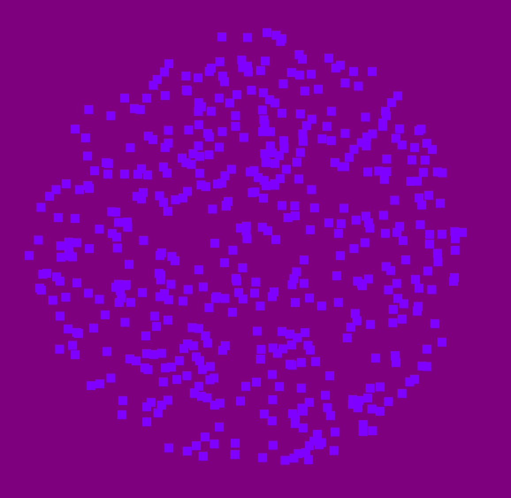

The following example, moving_dots.py will be examined. A program was written
to display the capabilities of the MovingDots stimulus.

Here is the definition of our *MovingDots*:

.. code-block:: python

@WidgetState.wrap
class MovingDots(Widget):
    """
    Moving dot (random dot motion) stimulus.

    Parameters
    ----------
    num_dots : int
        Number of dots active at one time.
    scale : int
        Size in pixels of the dots (really squares)
    radius : int
        Radius of the circle holding the dots.
    lifespan : float
        Mean life of each dot.
    lifespan_variance : float
        Range around the mean lifespan.
    speed : float
        Mean speed of the dots.
    speed_variance : float
        Range around the mean speed.
    coherence : float
        Proportion of dots going in a coherent direction.
        0.-coherence will go in random directions.
    direction : float
        Mean direction of the coherent dots in degrees.
    direction_variance : float
        Range around the mean direction.
    color : list
        Color of the dots.
    update_interval : float
        Rate of updating dot locations.

    Examples
    --------

    # now
    MovingDots(coherence=.2, direction=90)

    # the future
    MovingDots(coherence=[.2, .5, .1],
               direction=[0, 120, 240],
               num_dots=200)

    """
    num_dots = NumericProperty(100)
    scale = NumericProperty(4.0)
    radius = NumericProperty(200)
    lifespan = NumericProperty(.75)
    lifespan_variance = NumericProperty(0.5)
    speed = NumericProperty(100.)
    speed_variance = NumericProperty(0)
    coherence = NumericProperty(.5)
    direction = NumericProperty(0)
    direction_variance = NumericProperty(0)
    color = ListProperty([1., 1., 1., 1.])
    update_interval = NumericProperty(1. / 30.)

In *MovingDots*, several different parameters can be passed into the
`__init__` method in order to create different kinds of MovingDots stimuli.

- num_dots : An integer value that controls the amount of dots on screen at a time

- scale : An integer value that controls the size in pixels of the dots

- radius : An integer value that controls the radius of the circle where the dots are
           generated and exist in

- lifespan : A float value that controls the mean of how long a dot exists in seconds.

- lifespan_variance : A float value that controls the variance or range around the mean
                      of the lifespan. Example: if the lifespan is 1. second, and
                      the lifespan_variance is 0.5 second, the average dot will
                      last for 1. second. A dot could last for 1.5 seconds
                      or 0.5 seconds but that is less likely.

- speed : A float value that controls the mean of how fast or slow a dot moves on screen.

- speed_variance : A float value that controls the variance or range around the mean
                   of the speed value. Example: if the speed is 1., and
                   the speed_variance is 0.5 second, the average dot will
                   move for 1. units/second. A dot could move for 1.5
                   units/seconds or 0.5 units/seconds but that is less likely.

- coherence : A float value that controls the proportion of dots that cohere to a
              a set direction. A coherence of 0 will result in dots being generated
              and moving in completely random direction. A coherence of 0.5 will
              result in half of the dots moving in the direction set by the
              'direction' variable. A coherence of 1.0 will result in all of the
              dots moving in the direction set by the 'direction' variable.

- direction : A float value that controls the mean direction of the coherent dots
              in degrees.

- direction_variance : A float value that controls the variance or range around
                       the mean of the direction of the coherent dots. Example:
                       if the direction is 0., coherence is 1. and the direction_variance
                       is 0, all of the moving dots will move to the immediate right.
                       If the direction is 0., the coherence is 1., and the
                       direction_variance is 90, the mean of the dot direction
                       will be to the right, while some will go directly up, and
                       some will go directly down. The likelihood of a dot moving,
                       in a different direction other than to the immediate right
                       will become less likely the further away it becomes.

- color : a list of 3 values each ranging from zero to one which represents RGB
          coloring of the dots.

- update_interval : A float value that controls the rate of updating dot locations.

Next, the '__init__' method is declared for the 'MovinDots' widget:

.. code-block:: python

    def __init__(self, **kwargs):
        super(type(self), self).__init__(**kwargs)

        # set the width and height from radius
        self.width = self.radius*2
        self.height = self.radius*2

        # determine distribution of dots
        # for i in range(0, )
        num_coh = int(round(self.num_dots * self.coherence))
        num_rand = self.num_dots - num_coh

        # generate list of dots
        # first the coherent ones
        self.__dots = [Dot(radius=self.radius, scale=self.scale,
                           color=self.color,
                           direction=self.direction,
                           direction_variance=self.direction_variance,
                           speed=self.speed,
                           speed_variance=self.speed_variance,
                           lifespan=self.lifespan,
                           lifespan_variance=self.lifespan_variance)
                       for i in xrange(num_coh)]

        # then append the non-coh
        self.__dots.extend([Dot(radius=self.radius, scale=self.scale,
                                color=self.color,
                                direction=0.0,
                                direction_variance=360,
                                speed=self.speed,
                                speed_variance=self.speed_variance,
                                lifespan=self.lifespan,
                                lifespan_variance=self.lifespan_variance)
                            for i in xrange(num_rand)])

        # shuffle that list
        random.shuffle(self.__dots)

        Clock.schedule_once(self._update, self.update_interval)

The widget functions by first creating an amount of Dot objects that is directly
related to the proportion of coherent dots to the total amount of dots
(coherent dots / total dots). This creates an amount of dots that will cohere to
the desired directionality provided by that parameters. Next, if there are any
remaining dots to be created(total dots - (coherent dots / total dots)). The dots
will be created in random directions. The Dots class is as follows:

.. code-block:: python

    class Dot(object):
        def __init__(self, radius=100, scale=1.0,
                     color=[1.0, 1.0, 1.0, 1.0],
                     direction=0, direction_variance=0.0,
                     speed=1.0, speed_variance=0.0,
                     lifespan=.02, lifespan_variance=0.0):

            # process the input vars
            self.radius = radius
            self.scale = scale
            self.color = color
            self.direction = direction
            self.direction_variance = direction_variance
            self.speed = speed
            self.speed_variance = speed_variance
            self.lifespan = lifespan
            self.lifespan_variance = lifespan_variance

            # call reset to initialize the dot loc and dir
            self.reset()

        def update(self, passed_time):
            # update the lifetime
            self.current_time += passed_time

            # reset if past lifetime
            if self.current_time > self.total_time:
                # reset
                self.reset()
                return self.x, self.y

            # update the location
            self.x += self.velocity_x * passed_time
            self.y += self.velocity_y * passed_time

            # reset if outside radius
            if math.sqrt((self.x * self.x) + (self.y * self.y)) > self.radius:
                # must reset
                self.reset()
                return self.x, self.y

            # return x and y
            return self.x, self.y

 The class contains calculations that spawn a dot and move the dots after each update.
 The update method in the class controls the movement of the dots by returning the
 new position (x and y coordinate) of the dot every time the update method is called.
 The reset method determines the new location of the dot to be spawned at after
 the dot surpassed its lifespan or has moved beyond the "holding" circle.

 Now the functions of the widget can be defined:

.. code-block:: python

    def _update(self, dt):
        # advance time and locs for all dots
        bases = (self.x + self.scale, self.y+self.scale)
        locs = [bases[i % 2]+p+self.radius
                for i, p in enumerate(chain.from_iterable([d.update(dt)
                                                           for d in
                                                           self.__dots]))]

        # draw the dots
        self.canvas.clear()
        with self.canvas:
            # set the dot color
            Color(*self.color)

            # draw all the dots at their current locations
            Point(points=locs, pointsize=self.scale)

        # schedule next update
        Clock.schedule_once(self._update, self.update_interval)

The main function of the widget clears the canvas and redraws the moving dots with
Point().

Examples of MovingDots
======================

MovingDots()
When passing no parameters into the MovingDots widget, the return is defaults of
the program. Mainly, 100 dots with 50% of them moving to the right while the other
move randomly. The color is white, the scale is 4.0, and the radius is 200. More
information on the default variables can be seen above.

.. image:: _static/default_moving_dots.png
    :width: 540
    :height: 584
    :align: center

MovingDots(radius=500, color=[.5, 0., 1.], scale=10.0)
When passing radius, color, and scale parameters, notice the size of the MovingDots
widget gets larger, the color changed to blue, and the dots became larger:

.. image:: _static/scale_color_radius_change_moving_dots.png
    :width: 1266
    :height: 1164
    :align: center

MovingDots(radius=500, color=[.5, 0., 1.], scale=10.0, speed=200,
           speed_variance=100, lifespan=10, num_dots=500, coherence=1.)
This is the same parameters as the above example except the speed has increase,
the speed_variance has been set so some dots move faster or slower than the mean,
the number of dots has increased to 500, the lifespan has increased to 10, and
the coherence is 1. making all of the dots move in the same direction to the right:

*See moving_dots.py for complete Gabor filter creation code.*
